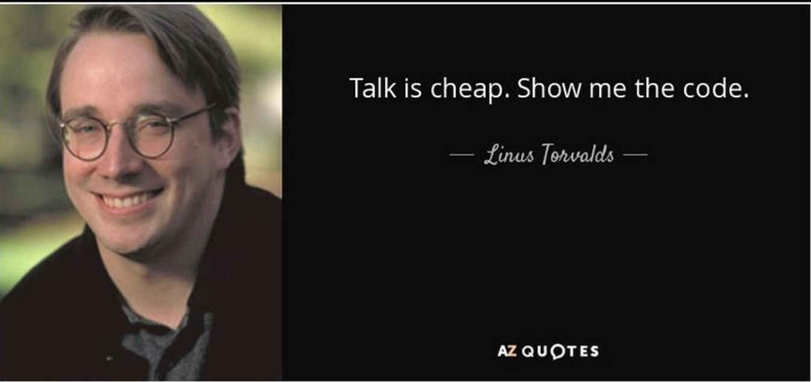
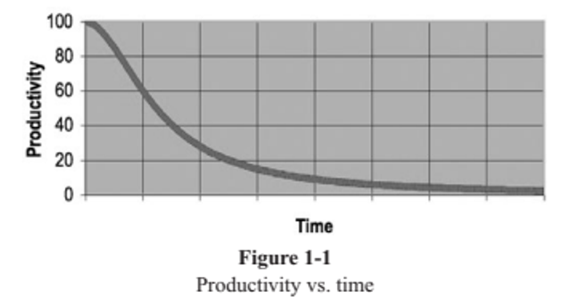

# [Clean Code] Ch1, Ch2

# Chapter 1 - Clean Code

- There Will Be Code 必須有代碼
  


- Bad Code 糟糕的代碼
  


- The Total Cost of Owning a Mess 混亂的代碼
  


    **整潔代碼特質**
    
    **•  Runs all the tests; 通過所有測試
    •  Contains no duplication; 沒有重複代碼
    •  Expresses all the design ideas that are in the system; 體現系統中的設計理念
    •  Minimizes the number of entities such as classes, methods, functions, and the like. 包含量少的實體，如類別、方法、函數**

- Summary 小結
  


# Chapter 2 - Meaningful Names

- **Introduction**

  Names are everywhere in software. We name our variables, our functions, our arguments, classes, and packages. We name our source files and the directories that contain them. We name our jar files and war files and ear files. We name and name and name. Because we do so much of it, we’d better do it well. What follows are some simple rules for creating good names.

  軟體中隨處可見名稱。 我們命名我們的變數、函式、引數、類和包。 我們命名我們的源檔案和包含它們的目錄。 我們命名我們的jar檔案、war檔案和ear檔案。 我們命名，命名，命名。我們最好把它做好。 以下是一些建立好名字的簡單規則。

- **Use Intention-Revealing Names 使用意圖揭示名稱**

  It is easy to say that names should reveal intent. What we want to impress upon you is that we are *serious* about this. Choosing good names takes time but saves more than it takes. So take care with your names and change them when you find better ones. Everyone who reads your code (including you) will be happier if you do.

  很容易說，名字應該揭示意圖。 我們想給你留下深刻印象的是，我們對此是認真的。 選擇好名字需要時間，但節省的比需要的要多。 所以照顧好你的名字，當你找到更好的名字時，請更改它們。 如果你讀了，每個閱讀你的程式的人（包括你）都會更快樂。

  The name of a variable, function, or class, should answer all the big questions. It should tell you why it exists, what it does, and how it is used. If a name requires a comment, then the name does not reveal its intent.

  變數、函式或類的名稱應該回答所有大問題。 它應該告訴你它為什麼存在，它的作用，以及它是如何使用的。 如果一個名字需要評論，那麼這個名字不會揭示其意圖。

    ```java
    int d; // elapsed time in days
    ```

  The name d reveals nothing. It does not evoke a sense of elapsed time, nor of days. We should choose a name that specifies what is being measured and the unit of that measurement:

    ```java
    int elapsedTimeInDays;
    int daysSinceCreation;
    int daysSinceModification;
    int fileAgeInDays;
    ```

  Choosing names that reveal intent can make it much easier to understand and change code. What is the purpose of this code?

    ```java
    public List<int[]> getThem() {
      List<int[]> list1 = new ArrayList<int[]>();
      for (int[] x : theList)
        if (x[0] == 4) list1.add(x);
      return list1;
    }
    ```

  Why is it hard to tell what this code is doing? There are no complex expressions. Spacing and indentation are reasonable. There are only three variables and two constants mentioned. There aren’t even any fancy classes or polymorphic methods, just a list of arrays (or so it seems).

  The problem isn’t the simplicity of the code but the *implicity* of the code (to coin a phrase): the degree to which the context is not explicit in the code itself. The code implicitly requires that we know the answers to questions such as:

  問題不在於程式的簡單性，而在於程式的隱含性（創造一個短語）：上下文在程式本身中不明確的程度。 程式暗示-它要求我們知道以下問題的答案：

    1. **What kinds of things are in theList?**
    2. **What is the significance of the zeroth subscript of an item in theList?**
    3. **What is the significance of the value 4?**
    4. **How would I use the list being returned?**

    1. 清單上有哪些東西？

    2. 列表中專案的零號下標的意義是什麼？

    3. 值4的意義是什麼？

    4. 我將如何使用返回的列表？

  The answers to these questions are not present in the code sample, *but they could have been*. Say that we’re working in a mine sweeper game. We find that the board is a list of cells called theList. Let’s rename that to gameBoard.

  程式樣本中沒有這些問題的答案，但它們可能是。 說我們正在玩掃雷遊戲。 我們發現該板是一個名為list的單元格列表。

  Each cell on the board is represented by a simple array. We further find that the zeroth subscript is the location of a status value and that a status value of 4 means “flagged.” Just by giving these concepts names we can improve the code considerably:

  讓我們把它重新命名為gameBoard。 板上的每個單元格都由一個簡單的陣列表示。 我們進一步發現，第零個下標是狀態值的位置，狀態值4表示“標記”。 只需給這些概念命名，我們就可以大大改進程式：

    ```
    public List<int[]> getFlaggedCells() {
      List<int[]> flaggedCells = new ArrayList<int[]>();
      for (int[] cell : gameBoard)
        if (cell[STATUS_VALUE] == FLAGGED)
          flaggedCells.add(cell);
      return flaggedCells;
    }
    ```

  Notice that the simplicity of the code has not changed. It still has exactly the same number of operators and constants, with exactly the same number of nesting levels. But the code has become much more explicit.

  請注意，程式的簡單性沒有改變。 它仍然具有完全相同數量的運算子和常量，具有完全相同的嵌套級別。 但程式變得更加明確。

  We can go further and write a simple class for cells instead of using an array of ints. It can include an intention-revealing function (call it isFlagged) to hide the magic numbers. It results in a new version of the function:

  我們可以更進一步，為單元格編寫一個簡單的類，而不是使用int陣列。 它可以包括一個揭示意圖的功能（稱其為Flagged）來隱藏神奇的數字。 它導致了函式的新版本：

    ```
    public List<Cell> getFlaggedCells() {
      List<Cell> flaggedCells = new ArrayList<Cell>();
      for (Cell cell : gameBoard)
      if (cell.isFlagged())
        flaggedCells.add(cell);
      return flaggedCells;
    }
    ```

  With these simple name changes, it’s not difficult to understand what’s going on. This is the power of choosing good names.

  有了這些簡單的名稱更改，瞭解發生了什麼並不難。 這就是選擇好名字的力量。

- **Avoid Disinformation 避免虛假資訊**

  Programmers must avoid leaving false clues that obscure the meaning of code.

  We should avoid words whose entrenched meanings vary from our intended meaning. For example, hp, aix, and sco would be poor variable names because they are the names of Unix plat- forms or variants. Even if you are coding a hypotenuse and hp looks like a good abbreviation, it could be dis-informative.

  程式設計師必須避免留下模糊程式含義的錯誤線索。 我們應該避免那些根深蒂固的含義與我們的預期含義不同的詞語。 例如，hp、aix和sco將是糟糕的變數名稱，因為它們是Unix平臺形式或變體的名稱。 即使你正在編碼斜邊，而hp看起來像一個很好的縮寫，它也可能是失教的。

  Do not refer to a grouping of accounts as an `accountList` unless it’s actually a `List`. The word list means something specific to programmers. If the container holding the accounts is not actually a List, it may lead to false conclusions. So `accountGroup` or `bunchOfAccounts` or just plain `accounts` would be better.

  不要將帳戶組稱為帳戶列表，除非它實際上是一個列表。 單詞列表對程式設計師來說意味著一些特定的東西。 如果持有帳戶的容器實際上不是列表，它可能會導致錯誤的結論。1因此，accountGroup或 bunchOfAccounts或只是普通帳戶會更好。

  Beware of using names which vary in small ways. How long does it take to spot the subtle difference between a XYZControllerForEfficientHandlingOfStrings in one module and, somewhere a little more distant, XYZControllerForEfficientStorageOfStrings? The words have frightfully similar shapes.

  小心使用略有不同的名字。 在一個模組中發現XYZControllerForEfficientHandlingOfStrings和更遠的地方XYZControllerForEfficientStorageOfStrings之間的微妙差異需要多長時間？ 這些詞的形狀非常相似。

  Spelling similar concepts similarly is *information*. Using inconsistent spellings is *dis- information*. With modern Java environments we enjoy automatic code completion. We write a few characters of a name and press some hotkey combination (if that) and are rewarded with a list of possible completions for that name. It is very helpful if names for very similar things sort together alphabetically and if the differences are very obvious, because the developer is likely to pick an object by name without seeing your copious comments or even the list of methods supplied by that class.

  類似的拼寫概念是資訊。 使用不一致的拼寫是不一致的資訊。 在現代Java環境中，我們享受自動程式完成。 我們寫幾個名字的字元，然後按一些熱鍵組合（如果那樣），並獲得該名字可能完成的列表。 如果非常相似的東西的名稱按字母順序排序，並且差異非常明顯，這非常有幫助，因為開發人員可能會按名稱選擇一個物件，而看不到您的大量註釋，甚至該類提供的方法列表。

  A truly awful example of disinformative names would be the use of lower-case L or uppercase O as variable names, especially in combination. The problem, of course, is that they look almost entirely like the constants one and zero, respectively.

  一個真正可怕的失資訊名稱的例子是使用小寫字母L或大寫字母O作為變數名稱，特別是組合。 當然，問題在於，它們看起來幾乎完全像常數1和0。

    ```java
    int a = l;
    if ( O == l )
      a=O1;
    else
      l=01;
    ```

  The reader may think this a contrivance, but we have examined code where such things were abundant. In one case the author of the code suggested using a different font so that the differences were more obvious, a solution that would have to be passed down to all future developers as oral tradition or in a written document. The problem is conquered with finality and without creating new work products by a simple renaming.

  讀者可能認為這是一種發明，但我們已經研究了大量此類內容的程式。 在一個案例中，程式的作者建議使用不同的字型，以便差異更加明顯，這個解決方案必須作為口頭傳統或書面檔案傳遞給所有未來的開發人員。 這個問題最終被征服了，沒有透過簡單的重命名來創造新的工作產品。

- **Make Meaningful Distinctions 做出有意義的區分**

  Programmers create problems for themselves when they write code solely to satisfy a compiler or interpreter. For example, because you can’t use the same name to referto two different things in the same scope, you might be tempted to change one namein an arbitrary way. Sometimes this is done by misspelling one, leading to the surprising situation where correcting spelling errors leads to an inability to compile.

  程式設計師在編寫程式時會為自己製造問題，因為他們只為編譯器或解釋器服務。 例如，由於您不能使用相同的名稱來引用同一範圍內的兩個不同的東西，您可能會被誘惑以任意的方式更改一個名稱。 有時，這是透過拼寫錯誤來完成的，這導致了一個令人驚訝的情況，即糾正拼寫錯誤會導致無法編譯。

  It is not sufficient to add number series or noise words, even though the compiler is satisfied. If names must be different, then they should also mean something different.

  即使編譯器滿意，新增數字序列或噪聲詞是不夠的。 如果名字必須不同，那麼它們也應該有不同的意思。

  Number-series naming (a1, a2, .. aN) is the opposite of intentional naming. Such names are not disinformative—they are noninformative; they provide no clue to the author’s intention. Consider:

  數字系列命名（a1，a2，..aN）是故意命名的反面。 這些名字不是不知情的——它們是不知情的；它們沒有為作者的意圖提供線索。 考慮：

    ```java
    public static void copyChars(char a1[], char a2[]) {
      for (int i = 0; i < a1.length; i++) {
        a2[i] = a1[i];
      }
    }
    ```

  This function reads much better when source and destination are used for the argument names.

  當源和目標用於引數名稱時，此函式的讀取要好得多。

  Noise words are another meaningless distinction. Imagine that you have a Product class. If you have another called ProductInfo or ProductData, you have made the names different without making them mean anything different. Info and Data are indistinct noise words like a, an, and the.

  噪音詞是另一個毫無意義的區別。 想象一下，你有一個產品類。 如果您有另一個名為ProductInfo或ProductData的名為ProductInfo或ProductData，則這些名稱不同，而沒有使它們具有不同的含義。 資訊和資料是模糊的噪音詞，如a、an和the。

  Note that there is nothing wrong with using prefix conventions like a and the so long as they make a meaningful distinction. For example you might use a for all local variables and the for all function arguments.3 The problem comes in when you decide to call a variable theZork because you already have another variable named zork.

  請注意，使用像a這樣的前綴約定沒有錯，只要它們做出有意義的區分。 例如，您可以對所有區域性變數和所有函式引數使用a。3當您決定呼叫可變的theZork時，會出現問題，因為您已經有另一個名為zork的變數。

  Noise words are redundant. The word variable should never appear in a variable name. The word table should never appear in a table name. How is NameString better than Name? Would a Name ever be a floating point number? If so, it breaks an earlier rule about disinformation. Imagine finding one class named Customer and another named CustomerObject. What should you understand as the distinction? Which one will represent the best path to a customer’s payment history?

  噪音詞是多餘的。 變數一詞絕不應該出現在變數名稱中。 字表絕不應該出現在表名中。 NameString如何比Name更好？ 名字會是一個浮點數嗎？ 如果如此，它違反了早期關於虛假資訊的規則。 想象一下，找到一個名為Customer的類和另一個名為CustomerObject的類。 你應該把區別理解為什麼？ 哪一個將代表客戶付款歷史記錄的最佳途徑？

  There is an application we know of where this is illustrated. we’ve changed the names to protect the guilty, but here’s the exact form of the error:

  我們知道有一個應用程式，說明了這一點。我們已經更改了名稱以保護有罪者，但以下是錯誤的確切形式：

    ```
    getActiveAccount();
    getActiveAccounts();
    getActiveAccountInfo();
    ```

  How are the programmers in this project supposed to know which of these functions to call?

  這個專案的程式設計師應該如何知道要呼叫這些函式中的哪一個？

  In the absence of specific conventions, the variable moneyAmount is indistinguishable from money, customerInfo is indistinguishable from customer, accountData is indistinguishable from account, and theMessage is indistinguishable from message. Distinguish names in such a way that the reader knows what the differences offer.

  在沒有特定慣例的情況下，可變貨幣金額與金錢無法區分，customerInfo與客戶無法區分，帳戶資料與帳戶無法區分，訊息與訊息無法區分。 以使讀者知道不同提供何不同的方式分辨名字。

- **Use Pronounceable Names 使用可發音的名字**

  Humans are good at words. A significant part of our brains is dedicated to the concept of words. And words are, by definition, pronounceable. It would be a shame not to take advantage of that huge portion of our brains that has evolved to deal with spoken language. So make your names pronounceable.

  人類擅長單詞。 我們大腦的一個重要部分致力於單詞的概念。 根據定義，單詞是可以發音的。

  If you can’t pronounce it, you can’t discuss it without sounding like an idiot. “Well, over here on the bee cee arr three cee enn tee we have a pee ess zee kyew int, see?” This matters because programming is a social activity.

  如果你不會發音，你就不能在不聽起來像白痴的情況下討論它。 “好吧，在蜜蜂裡，我們有一個小便ess zee kyew int，看到了嗎？” 這很重要，因為寫程式是一種社會活動。

  A company I know has genymdhms (generation date, year, month, day, hour, minute, and second) so they walked around saying “gen why emm dee aich emm ess”. I have an annoying habit of pronouncing everything as written, so I started saying “gen-yah-mudda- hims.” It later was being called this by a host of designers and analysts, and we still sounded silly. But we were in on the joke, so it was fun. Fun or not, we were tolerating poor naming. New developers had to have the variables explained to them, and then they spoke about it in silly made-up words instead of using proper English terms. Compare

  我認識的一家公司有genymdhms（生成日期、年份、月份、日期、小時、分鐘和秒），所以他們走來走去說“gen why emm dee aich emm ess”。 我有一個令人討厭的習慣，就是把所有東西都按原樣發音，所以我開始說“gen-yah-mudda- hims”。 後來被許多設計師和分析師這樣稱呼，我們聽起來仍然很愚蠢。 但我們開玩笑了，所以很有趣。 不管好玩不好玩，我們都容忍了糟糕的命名。 新開發人員必須向他們解釋變數，然後他們用愚蠢的編造詞語來談論它，而不是使用適當的英語術語。

    ```
    class DtaRcrd102 {
      private Date genymdhms;
      private Date modymdhms;
      private final String pszqint = "102";
      /* ... */
    };
    ```

  to

    ```
    class Customer {
      private Date generationTimestamp;
      private Date modificationTimestamp;;
      private final String recordId = "102";
      /* ... */
    };
    ```

  Intelligent conversation is now possible: “Hey, Mikey, take a look at this record! The generation timestamp is set to tomorrow’s date! How can that be?”

  智慧對話現在成為可能：“嘿，Mikey，看看這個記錄！ Generation時間戳設定為明天的日期！ 這怎麼可能？”

- **Use Searchable Names 使用可搜尋名稱**

  Single-letter names and numeric constants have a particular problem in that they are not easy to locate across a body of text.

  單字母名稱和數字常量有一個特殊問題，因為它們不容易在文字正文中找到。

  One might easily grep for MAX_CLASSES_PER_STUDENT, but the number 7 could be more troublesome. Searches may turn up the digit as part of file names, other constant definitions, and in various expressions where the value is used with different intent. It is even worse when a constant is a long number and someone might have transposed digits, thereby creating a bug while simultaneously evading the programmer’s search.

  人們可能很容易獲得MAX_CLASSES_PER_STUDENT，但數字7可能更麻煩。 搜尋可能會將數字作為檔名、其他常量定義的一部分，以及在以不同意圖使用該值的各種表示式中。 當常數是一個長數，而某人可能有轉置數字時，情況就更糟糕了，從而在逃避程式設計師搜尋的同時產生錯誤。

  Likewise, the name e is a poor choice for any variable for which a programmer might need to search. It is the most common letter in the English language and likely to show up in every passage of text in every program. In this regard, longer names trump shorter names, and any searchable name trumps a constant in code.

  同樣，對於程式設計師可能需要搜尋的任何變數來說，名稱e是一個糟糕的選擇。 這是英語中最常見的字母，可能出現在每個程式的每一段文字中。 在這方面，較長的名字勝過較短的名字，任何可搜尋的名字都勝過程式中的常量。

  My personal preference is that single-letter names can ONLY be used as local variables inside short methods. *The length of a name should correspond to the size of its scope* [N5]. If a variable or constant might be seen or used in multiple places in a body of code, it is imperative to give it a search-friendly name.

  我個人偏好的是，單字母名稱只能在短方法中用作本地變數。 名稱的長度應與其範圍的大小相對應。如果一個變數或常量可能在程式主體的多個位置被看到或使用，則必須給它一個搜尋友好的名稱。

  Once again compare

    ```
    for (int j=0; j<34; j++) {
      s += (t[j]*4)/5;
    }
    ```

  to

    ```
    int realDaysPerIdealDay = 4;
    const int WORK_DAYS_PER_WEEK = 5;
    int sum = 0;
    for (int j=0; j < NUMBER_OF_TASKS; j++) {
      int realTaskDays = taskEstimate[j] * realDaysPerIdealDay;
      int realTaskWeeks = (realdays / WORK_DAYS_PER_WEEK);
      sum += realTaskWeeks;
    }
    ```

  Note that sum, above, is not a particularly useful name but at least is searchable. The intentionally named code makes for a longer function, but consider how much easier it will be to find WORK_DAYS_PER_WEEK than to find all the places where 5 was used and filter the list down to just the instances with the intended meaning.

  請注意，上述總和不是一個特別有用的名稱，但至少是可搜尋的。 故意命名的程式使函式更長，但請考慮查詢WORK_DAYS_PER_WEEK比找到所有使用5的地方並僅將列表過濾到具有預期含義的例項要容易得多。

- **Avoid Encodings 避免變數編碼**

  We have enough encodings to deal with without adding more to our burden. Encoding type or scope information into names simply adds an extra burden of deciphering. It hardly seems reasonable to require each new employee to learn yet another encoding “language” in addition to learning the (usually considerable) body of code that they’ll be work- ing in. It is an unnecessary mental burden when trying to solve a problem. Encoded names are seldom pronounceable and are easy to mis-type.

  我們有足夠的編碼來處理，而不會增加我們的負擔。 將型別或範圍資訊編碼為名稱只會增加額外的破譯負擔。 除了學習他們將要處理的（通常相當多的）程式主體外，要求每個新員工學習另一個編碼“語言”似乎不太合理。 在試圖解決問題時，這是一個不必要的精神負擔。 編碼的名字很少能發音，而且很容易打錯字。

    - **Hungarian Notation** 匈牙利符號

      In days of old, when we worked in name-length-challenged languages, we violated this rule out of necessity, and with regret. Fortran forced encodings by making the first letter a code for the type. Early versions of BASIC allowed only a letter plus one digit. Hungarian Notation (HN) took this to a whole new level.

      古話說，當我們用名字長度具有挑戰性的語言工作時，我們出於必要和遺憾違反了這一規則。 透過將第一個字母作為型別的程式來強制編碼。 BASIC的早期版本只允許一個字母加一個數字。 匈牙利符號（HN）將此提升到一個全新的水準。

      HN was considered to be pretty important back in the Windows C API, when every- thing was an integer handle or a long pointer or a void pointer, or one of several implementations of “string” (with different uses and attributes). The compiler did not check types in those days, so the programmers needed a crutch to help them remember the types.

      在Windows C API中，HN被認為是相當重要的，當每個東西都是一個整數手柄或長指標或空穴，或者幾個“字串”的實現之一（具有不同的用途和屬性）。 在那些日裡，編譯器沒有檢查型別，所以程式設計師需要一根拐杖來幫助他們記住型別。

      In modern languages we have much richer type systems, and the compilers remember and enforce the types. What’s more, there is a trend toward smaller classes and shorter functions so that people can usually see the point of declaration of each variable they’re using.

      在現代語言中，我們有更豐富的型別系統，編譯器記住並強制執行型別。 更重要的是，有一種趨勢，即更小的類和更短的函式，因此人們通常可以看到他們使用的每個變數的宣告點。

      Java programmers don’t need type encoding. Objects are strongly typed, and editing environments have advanced such that they detect a type error long before you can run a compile! So nowadays HN and other forms of type encoding are simply impediments. They make it harder to change the name or type of a variable, function, or class. They make it harder to read the code. And they create the possibility that the encoding system will mislead the reader.

      Java程式設計師不需要型別編碼。 物件是強烈的型別，編輯環境已經高階化了，以至於早在執行編譯之前，它們就會檢測到型別錯誤！ 因此，如今HN和其他形式的型別編碼只是障礙。 它們使更改變數、函式或類的名稱或型別變得更加困難。 他們使閱讀程式變得更加困難。 它們造成了編碼系統誤導讀者的可能性。

        ```
        PhoneNumber phoneString;
        // name not changed when type changed!
        ```

    - **Member Prefixes**

      You also don’t need to prefix member variables with m_ anymore. Your classes and functions should be small enough that you don’t need them. And you should be using an editing environment that highlights or colorizes members to make them distinct.

      您也不再需要將成員變數前加上m_。 你的課程和函式應該足夠小，以至於你不需要它們。 您應該使用一個編輯環境來突出顯示或著色成員，使其與眾不同。

        ```
        public class Part {
          private String m_dsc; // The textual description
          void setName(String name) {
            m_dsc = name;
          }
        }
        _________________________________________________
        
        public class Part {
          String description;
          void setDescription(String description) {
            this.description = description;
          }
        }
        ```

      Besides, people quickly learn to ignore the prefix (or suffix) to see the meaningful part of the name. The more we read the code, the less we see the prefixes. Eventually the prefixes become unseen clutter and a marker of older code.

      此外，人們很快就學會忽略字首（或字尾）來檢視名稱的有意義部分。 我們讀的程式越多，看到字首就越少。 最終，字首變成了看不見的雜亂無章和舊程式的標記。

    - **Interfaces and Implementations 介面與實現**

      These are sometimes a special case for encodings. For example, say you are building an ABSTRACT FACTORY for the creation of shapes. This factory will be an interface and will be implemented by a concrete class. What should you name them? `IShapeFactory` and `ShapeFactory`? I prefer to leave interfaces unadorned. The preceding `I`, so common in today’s legacy wads, is a distraction at best and too much information at worst. I don’t want my users knowing that I’m handing them an interface. I just want them to know that it’s a `ShapeFactory`. So if I must encode either the interface or the implementation, I choose the implementation. Calling it `ShapeFactoryImp`, or even the hideous `CShapeFactory`, is preferable to encoding the interface.

      這些有時是編碼的特殊情況。 例如，假設您正在建造一個用於建立形狀的抽象工廠。 這個工廠將是一個介面，並將由一個具體類來實現。 你應該給他們取什麼名字？ IShapeFactory和ShapeFactory？ 我更喜歡讓介面不加裝飾。 前面的I，在今天的遺產中很常見，充其量是分散注意力，最糟糕的是資訊太多。 我不想讓我的使用者知道我正在給他們一個介面。 我只是想讓他們知道這是一個ShapeFactory。 因此，如果我必須對介面或實現進行編碼，我會選擇實現。 稱其為ShapeFactoryImp，甚至是醜陋的CShapeFactory，可以對介面進行編碼。

- **Avoid Mental Mapping 避免心理對映**

  Readers shouldn’t have to mentally translate your names into other names they already know. This problem generally arises from a choice to use neither problem domain terms nor solution domain terms.

  讀者不應該在精神上將你的名字翻譯成他們已經知道的其他名字。 這個問題通常源於既不使用問題域術語也不使用解決方案域術語的選擇。

  This is a problem with single-letter variable names. Certainly a loop counter may be named i or j or k (though never l!) if its scope is very small and no other names can conflict with it. This is because those single-letter names for loop counters are traditional. However, in most other contexts a single-letter name is a poor choice; it’s just a place holder that the reader must mentally map to the actual concept. There can be no worse reason for using the name c than because a and b were already taken.

  這是單字母變數名的問題。 當然，迴圈計數器可以命名為i或j或k（儘管從不l！） 如果它範圍很小，並且沒有其他名字可以與它混淆。 這是因為迴圈計數器的單字母名稱是傳統的。 然而，在大多數其他上下文中，單字母名稱是一個糟糕的選擇；它只是一個位置持有人，讀者必須在精神上對映到實際的概念。 使用c這個名字沒有比因為a和b已經被拿走了更糟糕的了。

  In general programmers are pretty smart people. Smart people sometimes like to show off their smarts by demonstrating their mental juggling abilities. After all, if you can reliably remember that r is the lower-cased version of the url with the host and scheme removed, then you must clearly be very smart.

  一般來說，程式設計師是相當聰明的人。 聰明的人有時喜歡透過展示他們的精神雜耍能力來炫耀他們的聰明才智。 畢竟，如果你能可靠地記住，r是刪除了主機和方案的URL的低大寫版本，那麼你顯然必須非常聰明。

  One difference between a smart programmer and a professional programmer is that the professional understands that *clarity is king*. Professionals use their powers for good and write code that others can understand.

  聰明的程式設計師和專業程式設計師之間的一個區別是，專業人士明白清晰度是王道。 專業人士利用自己的力量做好事，編寫其他人能理解的程式。

- **Class Names 類別名稱**

  Classes and objects should have noun or noun phrase names like Customer, WikiPage, Account, and AddressParser. Avoid words like Manager, Processor, Data, or Info in the name of a class. A class name should not be a verb.

  類和物件應該有名詞或名詞短語名稱，如客戶、維基頁面、帳戶和地址解析器。 避免在類名下使用經理、處理器、資料或資訊等詞語。 類名不應該是動詞。

- **Method Names 方法名稱**

  Methods should have verb or verb phrase names like postPayment, deletePage, or save. Accessors, mutators, and predicates should be named for their value and prefixed with get, set, and is according to the java bean standard.

  方法應該有動詞或動詞短語名稱，如postPayment、deletePage或save。 訪問器、突變器和謂詞應以其值命名，並以get、set為前，並根據javabean標準命名。

    ```java
    string name = employee.getName();
    customer.setName("mike");
      if (paycheck.isPosted())...
    ```

  When constructors are overloaded, use static factory methods with names that describe the arguments. For example,

  當建構函式重載時，請使用帶有描述引數名稱的靜態工廠方法。 例如，

    ```java
    Complex fulcrumPoint = Complex.FromRealNumber(23.0);
    ```

  is generally better than

    ```java
    Complex fulcrumPoint = new Complex(23.0);
    ```

  Consider enforcing their use by making the corresponding constructors private.

  考慮透過使相應的構造器私有來強制使用它們。

  ### Example

    ```java
    public class Animal {
        private String type;
        private int legs;
    
    		//constructor 設為private
        private Animal(){}
        private Animal(String type, int legs) {
            this.type = type;
            this.legs = legs;
        }
    
    		//透過靜態方法來提供建構式
        public static Animal createCat() {
            return new Animal("Cat", 4);
        }
        public static Animal createBird() {
            return new Animal("Bird", 2);
        }
    }
    
    class Main {
        public static void main(String[] args) {
            Animal mammal = Animal.createCat();
            Animal bird = Animal.createBird();
        }
    }
    ```

- **Don’t Be Cute 不要裝可愛**

  If names are too clever, they will be memorable only to people who share the author’s sense of humor, and only as long as these people remember the joke. Will they know what the function named HolyHandGrenade is supposed to do? Sure, it’s cute, but maybe in this case DeleteItems might be a better name. Choose clarity over entertainment value.

  如果名字太聰明，它們只會讓與作者有幽默感的人感到難忘，而且只要這些人記得這個笑話。 他們會知道名為HolyHandGrenade的功能應該做什麼嗎？ 當然，它很可愛，但在這種情況下，DeleteItems可能是一個更好的名字。 選擇清晰度而不是娛樂價值。

  Cuteness in code often appears in the form of colloquialisms or slang. For example, don’t use the name whack() to mean kill(). Don’t tell little culture-dependent jokes like eatMyShorts() to mean abort().

  程式中的可愛通常以俗語或俚語的形式出現。 例如，不要使用whack（）這個名字來表示kill()。 不要把像eatMyShorts（）這樣的依賴文化的小笑話說成中止（）。

  Say what you mean. Mean what you say.

  說你的意思。 你說的話是故意的。

- **Pick One Word per Concept** **為一個抽象概念選擇一個單詞**

  Pick one word for one abstract concept and stick with it. For instance, it’s confusing to have fetch, retrieve, and get as equivalent methods of different classes. How do you remember which method name goes with which class? Sadly, you often have to remember which company, group, or individual wrote the library or class in order to remember which term was used. Otherwise, you spend an awful lot of time browsing through headers and previous code samples.

  為一個抽象概念選擇一個單詞，並堅持下去。 例如，將獲取、檢索和獲取作為不同類的等價方法令人困惑。 你如何記住哪個方法名稱與哪個類搭配？ 可悲的是，你經常必須記住哪個公司、團體或個人寫了圖書館或班級，才能記住使用了哪個術語。 否則，您將花費大量時間瀏覽標題和之前的程式示例。

  Modern editing environments like Eclipse and IntelliJ-provide context-sensitive clues, such as the list of methods you can call on a given object. But note that the list doesn’t usually give you the comments you wrote around your function names and parameter lists. You are lucky if it gives the parameter *names* from function declarations. The function names have to stand alone, and they have to be consistent in order for you to pick the correct method without any additional exploration.

  Eclipse和IntelliJ等現代編輯環境提供了上下文敏感的線索，例如您可以在給定物件上呼叫的方法列表。 但請注意，該列表通常不會為您提供圍繞函式名稱和引數列表編寫的評論。 如果它從函式宣告中給出引數名稱，那你就很幸運了。 函式名稱必須是獨立的，並且它們必須是一致的，以便您選擇correct方法，而無需任何額外的探索。

  Likewise, it’s confusing to have a controller and a manager and a driver in the same code base. What is the essential difference between a DeviceManager and a Protocol- Controller? Why are both not controllers or both not managers? Are they both Drivers really? The name leads you to expect two objects that have very different type as well as having different classes.

  同樣，在同一程式庫中有一個控制器、一個經理和一個驅動程式也是令人困惑的。 DeviceManager和協議控制器之間的本質區別是什麼？ 為什麼兩者都不是控制器，或者兩者都不是經理？ 他們倆真的是司機嗎？ 這個名稱導致您期望兩個物件具有非常不同的型別以及具有不同的類。

  A consistent lexicon is a great boon to the programmers who must use your code.

  對於必須使用您的程式的程式設計師來說，一致的詞彙表是一個很大的福音。

  ### Example

    ```java
    //worse case
    //在同個class中，查詢DB資料的方法有
    public class userService{
    	public UserInfo getUserInfoById()
    	public UserInfo retrieveUserInfoByName()
    	public UserInfo fetchUserInfoByAge()
    }
    
    //better case
    同個概念的詞彙統一使用
    ```

- **Don’t Pun 不要雙關**

  Avoid using the same word for two purposes. Using the same term for two different ideas is essentially a pun.

  避免將同一個詞用於兩個目的。 對兩個不同的想法使用相同的術語本質上是一個雙關語。

  If you follow the “one word per concept” rule, you could end up with many classes that have, for example, an add method. As long as the parameter lists and return values of the various add methods are semantically equivalent, all is well.

  如果您遵循“每個概念一個單詞”規則，您最終可能會獲得許多具有例如新增方法的類。 只要各種新增方法的引數列表和返回值在語義上是等效的，一切都很好。

  However one might decide to use the word add for “consistency” when he or she is not in fact adding in the same sense. Let’s say we have many classes where add will create a new value by adding or concatenating two existing values. Now let’s say we are writing a new class that has a method that puts its single parameter into a collection. Should we call this method add? It might seem consistent because we have so many other add methods, but in this case, the semantics are different, so we should use a name like insert or append instead. To call the new method add would be a pun.

  然而，當他或她實際上沒有在相同意義上新增時，人們可能會決定使用新增一詞來表示“一致性”。 假設我們有很多類，其中add將透過新增或串聯兩個現有值來建立新值。 現在，假設我們正在編寫一個新的類，該類具有將其單個引數放入集合中的方法。 我們應該稱之為add嗎？ 這似乎很一致，因為我們有很多其他的新增方法，但在這種情況下，語義是不同的，所以我們應該使用像插入或附加這樣的名稱。 呼叫新方法add將是一個雙關語。

  Our goal, as authors, is to make our code as easy as possible to understand. We want our code to be a quick skim, not an intense study. We want to use the popular paperback model whereby the author is responsible for making himself clear and not the academic model where it is the scholar’s job to dig the meaning out of the paper.

  作為作者，我們的目標是使我們的程式儘可能容易理解。 我們希望我們的程式是快速的略讀，而不是密集的研究。 我們希望使用流行的平裝本模型，即作者負責澄清自己，而不是學者的工作是挖掘論文含義的學術模式。

  ### Example

    ```java
    //書中case
    add就是一個帶有雙關的用詞，應該用insert, append更精確的詞來表達
    
    //other case 讓人混淆的用詞就要避免
    createUser -> user是customer or employee?
    ```

- **Use Solution Domain Names 使用解決方案領域名稱**

  Remember that the people who read your code will be programmers. So go ahead and use computer science (CS) terms, algorithm names, pattern names, math terms, and so forth. It is not wise to draw every name from the problem domain because we don’t want our coworkers to have to run back and forth to the customer asking what every name means when they already know the concept by a different name.

  請記住，閱讀您的程式的人將是程式設計師。 因此，請繼續使用計算機科學（CS）術語、演算法名稱、模式名稱、數學術語等。 從問題域中抽取每個名字是不明智的，因為我們不希望我們的同事在客戶已經知道不同名字的概念時來回奔波，詢問每個名字的含義。

  The name AccountVisitor means a great deal to a programmer who is familiar with the VISITOR pattern. What programmer would not know what a JobQueue was? There are lots of very technical things that programmers have to do. Choosing technical names for those things is usually the most appropriate course.

  AccountVisitor這個名字對熟悉訪客模式的程式設計師來說意義重大。 哪個程式設計師不知道JobQueue是什麼？ 程式設計師必須做很多非常技術性的事情。 為這些東西選擇技術名稱通常是最合適的課程。

- **Use Problem Domain Names 使用問題領域名稱**

  When there is no “programmer-eese” for what you’re doing, use the name from the problem domain. At least the programmer who maintains your code can ask a domain expert what it means.

  當您正在做的事情沒有“programmer-eese”時，請使用problem域中的名稱。 至少維護您程式的程式設計師可以詢問域專家這意味著什麼。

  Separating solution and problem domain concepts is part of the job of a good programmer and designer. The code that has more to do with problem domain concepts should have names drawn from the problem domain.

  分離解決方案和問題領域概念是優秀的程式設計師和設計師工作的一部分。 與問題域概念更關係的程式應該從問題域中提取名稱。

  ### Example

    ```java
    外匯市場中的槓桿 -> leverage
    如果開發人員將其變數命名為betRate就會有認知上的落差
    ```

- **Add Meaningful Context 新增有意義的上下文**

  There are a few names which are meaningful in and of themselves—most are not. Instead, you need to place names in context for your reader by enclosing them in well-named classes, functions, or namespaces. When all else fails, then **prefixing** the name **may be necessary** as a last resort.

  有一些名字本身就很有意義——大多數都沒有。 相反，您需要在上下文中為讀者放置名稱，方法是將它們括在命名良好的類、函式或名稱空間中。 當其他一切都失敗時，作為最後手段，可能需要在名字前加上字首。

  Imagine that you have variables named firstName, lastName, street, houseNumber, city, state, and zipcode. Taken together it’s pretty clear that they form an address. But what if you just saw the state variable being used alone in a method? Would you automatically infer that it was part of an address?

  想象一下，您有名為名字、姓氏、街道、門號、城市、州和郵政編碼的變數。 總的來說，很明顯，他們形成了一個地址。 但是，如果您只是看到狀態變數在方法中單獨使用呢？

  You can add context by using prefixes: addrFirstName, addrLastName, addrState, and so on. At least readers will understand that these variables are part of a larger structure. Of course, a better solution is to create a class named Address. Then, even the compiler knows that the variables belong to a bigger concept.

  你會自動推斷它是地址的一部分嗎？ 您可以使用前綴來新增上下文：addrFirstName、addrLastName、addrState等。 至少讀者會明白，這些變數是更大結構的一部分。 當然，更好的解決方案是建立一個名為Address的類。 然後，即使是編譯器也知道變數屬於一個更大的概念。

  Consider the method in Listing 2-1. Do the variables need a more meaningful context? The function name provides only part of the context; the algorithm provides the rest. Once you read through the function, you see that the three variables, number, verb, and pluralModifier, are part of the “guess statistics” message. Unfortunately, the context must be inferred. When you first look at the method, the meanings of the variables are opaque.

  考慮清單2-1中的方法。 變數需要更有意義的context嗎？ 函式名僅提供上下文的一部分；演算法提供其餘部分。 一旦您通讀了該函式，您就會發現三個變數，即數字、動詞和複數修飾符，是“猜測統計”訊息的一部分。 不幸的是，上下文必須被推斷。 當你第一次看方法時，變數的含義是不透明的。

    ```java
    //Listing 2-1
    //Variables with unclear context.
    
    private void printGuessStatistics(char candidate, int count) {
      String number;
      String verb;
      String pluralModifier;
      if (count == 0) {
        number = "no";
        verb = "are";
        pluralModifier = "s";
      } else if (count == 1) {
        number = "1";
        verb = "is";
        pluralModifier = "";
      } else {
        number = Integer.toString(count);
        verb = "are";
        pluralModifier = "s";
      }
      String guessMessage = String.format(
        "There %s %s %s%s", verb, number, candidate, pluralModifier
      );
      print(guessMessage);
    }
    ```

  The function is a bit too long and the variables are used throughout. To split the function into smaller pieces we need to create a GuessStatisticsMessage class and make the three variables fields of this class. This provides a clear context for the three variables. They are *definitively* part of the GuessStatisticsMessage. The improvement of context also allows the algorithm to be made much cleaner by breaking it into many smaller functions. (See Listing 2-2.)

  該函式有點太長了，變數自始至終都在使用。 要將功能拆分成較小的部分，我們需要建立一個GuessStatisticsMessage類，並製作該類的三個變數欄位。 這為三個變數提供了清晰的上下文。 它們絕對是GuessStatisticsMessage的一部分。 上下文的改進還允許將演算法分解為許多較小的函式，從而使其更加清晰。 （見清單2-2。）

    ```java
    //Listing 2-2
    //Variables have a context.
    
    public class GuessStatisticsMessage {
      private String number;
      private String verb;
      private String pluralModifier;
      public String make(char candidate, int count) {
        createPluralDependentMessageParts(count);
        return String.format(
          "There %s %s %s%s",
          verb, number, candidate, pluralModifier );
      }
      private void createPluralDependentMessageParts(int count) {
      if (count == 0) {
        thereAreNoLetters();
      } else if (count == 1) {
        thereIsOneLetter();
      } else {
        thereAreManyLetters(count); }
      }
      private void thereAreManyLetters(int count) {
        number = Integer.toString(count);
        verb = "are";
        pluralModifier = "s";
      }
      private void thereIsOneLetter() {
        number = "1";
        verb = "is";
        pluralModifier = "";
      }
      private void thereAreNoLetters() {
        number = "no";
        verb = "are";
        pluralModifier = "s";
      }
    }
    ```

  ### Example

    ```java
    //method中沒有把步驟粒度拆清楚，那在裡頭的變數就會需要看程式邏輯(context)去推測其用意
    //但如果方法粒度拆得夠清楚，那就能較知道變數的意圖
    
    //ex. 生日 birthDay => year + month + date 
    //如果在一個方法中context表現出的意圖不夠明顯，那麼可以考慮把它們命名為birthYear之類
    //但以內文的範例來看，最好還是能把方法粒度拆清楚，能不透過prefix的命名來表達意圖
    //實務上也確實是要把方法粒度拆清楚，後續debug或維護都會比較好。
    ```

- **Don’t Add Gratuitous Context 不要新增無償的上下文**

  In an imaginary application called “Gas Station Deluxe,” it is a bad idea to prefix every class with GSD. Frankly, you are working against your tools. You type G and press the completion key and are rewarded with a mile-long list of every class in the system. Is that wise? Why make it hard for the IDE to help you?

  在一個名為“Gas Station Deluxe”的假想應用程式中，將每個類前加上GSD是一個壞主意。 坦率地說，你在與你的工具對抗。 您鍵入G並按completion鍵，您將獲得系統中每個班級的一英里長列表。 那明智嗎？ 為什麼讓IDE很難幫助你？

  Likewise, say you invented a MailingAddress class in GSD’s accounting module, and you named it GSDAccountAddress. Later, you need a mailing address for your customer con- tact application. Do you use GSDAccountAddress? Does it sound like the right name? Ten of 17 characters are redundant or irrelevant.

  同樣，假設您在GSD的會計模組中發明了一個MailingAddress類，並將其命名為GSDAccountAddress。 稍後，您需要一個郵寄地址來申請客戶。 你使用GSDAccountAddress嗎？ 聽起來名字合適嗎？ 17個字元中有10個是多餘或不相關的。

  Shorter names are generally better than longer ones, **so long as they are clear**. Add no more context to a name than is necessary.

  較短的名字通常比較長的名字好，只要它們是明確的。 在名稱中新增的上下文不要超過必要的內容。

  The names accountAddress and customerAddress are fine names for instances of the class Address but could be poor names for classes. Address is a fine name for a class. If I need to differentiate between MAC addresses, port addresses, and Web addresses, I might consider PostalAddress, MAC, and URI. The resulting names are more precise, which is the point of all naming.

  名稱accountAddress和customerAddress是類地址例項的精美名稱，但可能是類的糟糕名稱。 地址是一個班級的好名字。 如果我需要區分MAC地址、埠地址和網址，我可能會考慮PostalAddress、MAC和URI。 由此產生的名稱更精確，這是所有命名的要點。

  ### Example

    ```java
    public class Car {
      private String carColor
      private Integer carNumber
      private String carType
    }
    ```