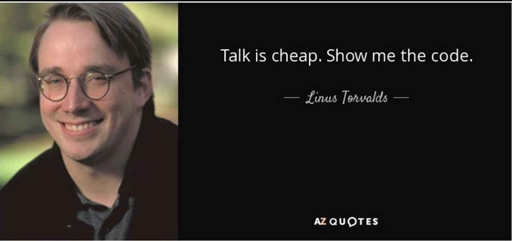
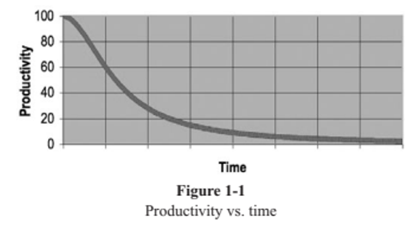
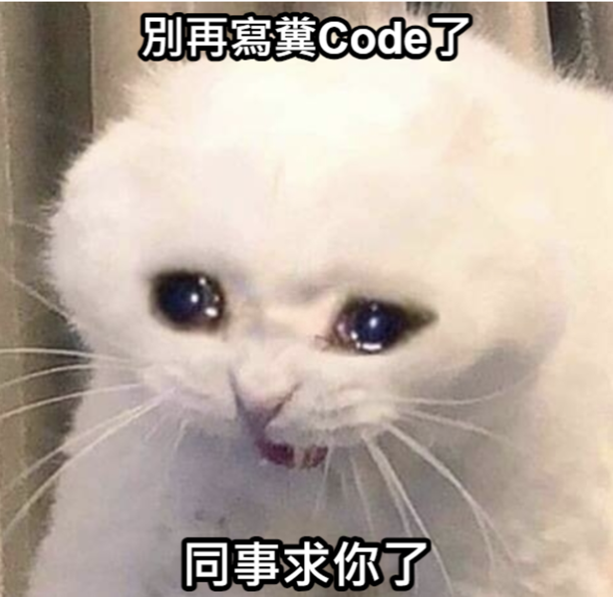

# Chapter 1 - Clean Code

- There Will Be Code 必須有代碼
  

- Bad Code 糟糕的代碼
  

- The Total Cost of Owning a Mess 混亂的代碼
  

    **整潔代碼特質**
    
    **•  Runs all the tests; 通過所有測試
    •  Contains no duplication; 沒有重複代碼
    •  Expresses all the design ideas that are in the system; 體現系統中的設計理念
    •  Minimizes the number of entities such as classes, methods, functions, and the like. 包含量少的實體，如類別、方法、函數**

- Summary 小結
  

