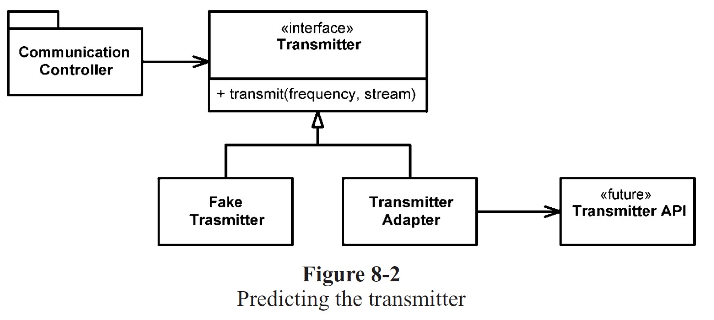
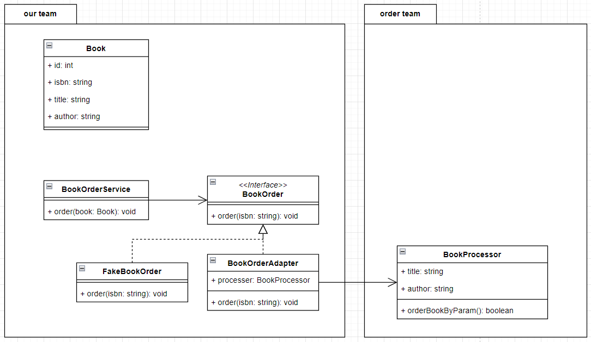

# Ch 8 邊界 (Boundaries)

<details>
    <summary>使用外部程式碼 (Third-Party Code)</summary>

第三方套件和框架的提供者，和套件的使用者
兩者之間存在一股張力 (tension) (對立或衝突)，導致系統邊界出問題

```java
// 不好的寫法，直接回傳 map
Map sensors = new HashMap();
sensors.put(1, new Sensor());
return sensors;


// 好的寫法，回傳自己包一層的 Sensors 類別
Sensors sensors = new Sensors();
sensors.addSensor(1, new Sensor());
return sensors;


// Sensors 類別
public class Sensors {
    private Map sensors = new HashMap();
    public Sensor getById(String id) {
        return (Sensor) sensors.get(id);
    }
    // 省略其他的程式碼
}
```

* 作者給的建議：
  不要在系統內傳遞 Map (或其他介面)，請放在類別內部裡

</details>


<details>
    <summary>探索及學習邊界</summary>

當我們想要使用某個第三方套件時
作者認為最好的方法，是替第三方套件寫一些測試程式
這種測試被稱為「學習式測試 (learning tests)」

透過「學習式測試」的方式，我們可以更好的探索和理解這些邊界
確保我們對第三方 API 的理解是正確的
同時減少「整合不熟悉的套件到產品程式碼中」帶來的風險
這種方式能確保，我們對外部系統和第三方套件的使用方式，有正確的了解

</details>


<details>
    <summary>學習式測試 log4j</summary>

假設我們想學習 Apache 的 log4j 套件
可以打開官網，下載套件，簡單閱讀後
直接寫下第一個測試

```java
@Test
public void testLogCreate() {
	Logger logger = Logger.getLogger("MyLogger");
	logger.info("hello");
}
```

如果我們執行測試程式，會產生一個錯誤，告訴我們需要 Appender
然後繼續閱讀文件，發現有 `ConsoleAppender`
於是建立 `ConsoleAppender` 後再試一次

```java
@Test
public void testLogAddAppender() {
	Logger logger = Logger.getLogger("MyLogger");
	ConsoleAppender appender = new ConsoleAppender();
	logger.addAppender(appender);
	logger.info("hello");
}
```

這次我們發現雖然沒有跳出錯誤，但 console 並沒有輸出
因此我們 Google 一下，並試了下面的程式


```java
@Test
public void testLogAddAppender() {
	Logger logger = Logger.getLogger("MyLogger");
	logger.removeAllAppenders();
	logger.addAppender(new ConsoleAppender(
			new PatternLayout("%p %t %m%n"),ConsoleAppender.SYSTEM_OUT));
	logger.info("hello");
}
```
執行成功了


然後多花一點時間繼續閱讀、測試
最後完成了測試程式
```java
public class LogTest {
	private Logger logger;

	@Before
	public void initialize() {
		logger = Logger.getLogger("logger");
		logger.removeAllAppenders();
		Logger.getRootLogger().removeAllAppenders();
	}

	@Test
	public void basicLogger() {
		BasicConfigurator.configure();
		logger.info("basicLogger");
	}

	@Test
	public void addAppenderWithStream() {
		logger.addAppender(new ConsoleAppender(
				new PatternLayout("%p %t %m%n"), ConsoleAppender.SYSTEM_OUT));
		logger.info("addAppenderWithStream");
	}

	@Test
	public void addAppenderWithoutStream() {
		logger.addAppender(new ConsoleAppender(new PatternLayout("%p %t %m%n")));
		logger.info("addAppenderWithoutStream");
	}
}
```

</details>


<details>
    <summary>學習式測試的好處</summary>

學習式測試並不會花費太多時間和精力
透過寫測試來學習，並獲得知識，是簡單又沒有不良影響的學習方式

當第三方套件發布新版本的時候，我們可以執行這個測試
來觀察新版本有沒有改變任何行為或方法
幫助我們驗證第三方套件是否按照我們的預期執行

如果沒有這些「邊界測試」來減輕升級整合造成的問題
我們幾乎會一直停留在舊版本，而不去升級到新版本

</details>


<details>

<summary>使用未存在的程式碼</summary>

有時候，邊界的另一邊是未知的 (至少當下還未知)
我們只能選擇察看到邊界為止，無法再往下探索

* 作者給了一個範例
  

* 為了方便講解，用自己的例子
  

使用轉接器模式
好處是隔離了未知且我們無法控制的程式
並且方便我們做測試

</details>


<details>
    <summary>簡潔的邊界</summary>

很多的事情會發生在邊界上，其中一個就是改變
好的軟體設計可以適應邊界改變，不用大規模的重新撰寫程式
當使用無法控制程式碼時，要特別花心力去保護已經開發好的程式碼
確保不必花太多時間，就能因應未來的修改

</details>

