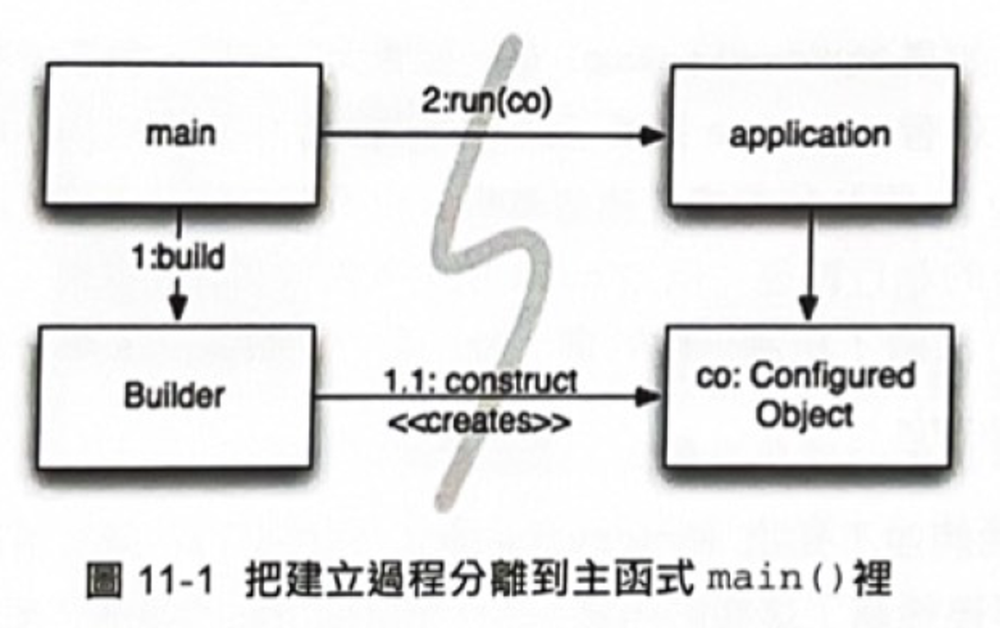
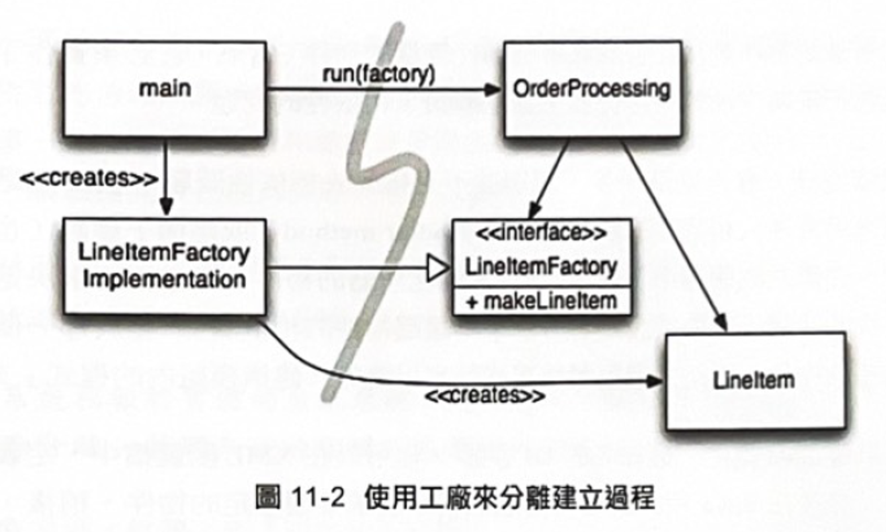
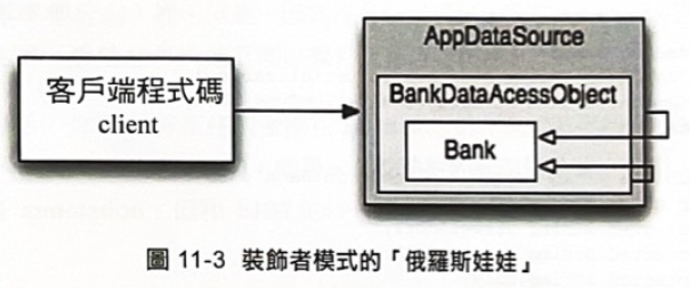

# Ch 11 Systems 系統
<details>
    <summary>1. 分離「使用」和「建造」</summary>

軟體系統應該將「啟動過程」與啟動後的「運行邏輯」分開

這裡有一個典型的例子
```java
public Service getService() {
    // Good enough default for most cases?
    // 大部分的情況下，這樣的預設值夠好了嗎?
    if (service == null)
        service = new MyServiceImpl(...);
    return service;
}
```
這個例子是典型的延遲初始化 (LAZY INITIALIZATION)，這個概念是好的
但是現在卻寫死 (hard-code) 依賴於 `MyServiceImpl` 和其建構子的參數

測試也會是問題，如果 `MyServiceImpl` 是個龐大的物件
我們就要找到合適的測試替身 (TEST DOUBLE) 或模擬物件 (MOCK OBJECT)
因為我們將「建造邏輯」和「正常執行過程」混在一起
所以測試時，我們必須測試這兩條路徑
這代表這個方法做了超過一件事，所以違反了 SRP 單一職責原則

</details>


<details>
    <summary>1-1 分離到主程式</summary>

要把「建造物件」的過程分離出來
最簡單的方法是把建造的程式碼，都移到主程式 main，或是移到主程式呼叫的模組裡
在寫程式時，就假設所有的物件都已經順利建造完，並且正確的串連在一起 (如圖 11-1)


這樣的控制流程變的很簡單
main 方法建造系統需要的物件，然後將物件傳遞給 application (應用程式)
application 只需要專注在如何使用物件即可

</details>


<details>
    <summary>1-2 工廠</summary>

有時候，需求必須讓 application 決定「**何時**」建立物件
例如在訂單系統中，必須要建立 LineItem (行列項目) 的實例，加入到 Order (訂單) 物件中
這種情況下，我們可以使用抽象工廠模式 (ABSTRACT FACTORY)
讓 application 自行控制何時建立 LineItem
但也讓建立的細節，隔離在 application 的程式碼外 (如圖 11-2)



</details>


<details>
    <summary>1-3 依賴注入 (Dependency Injection)</summary>

將建立過程從使用中分離出來，有個好的機制就是**依賴注入** (Dependency Injection，DI)
這是**控制反轉** (Inversion of Control，IoC) 中，依賴管理的一種應用手段

控制反轉中的依賴管理認為
一個物件不應該負責本身的實體化，而是把責任交給另一個「授權」的物件

例如：
```java
MyService myService = (MyService)(jndiContext.lookup("NameOfMyService"));
```

Spring 框架替 Java 提供了最知名的 DI 容器
讓開發人員可以在 XML 配置檔中﹐定義好互相串連的物件
在 Java 程式碼裡，透過名稱來取得特定的物件

</details>

<details>
    <summary>2. 擴大 (Scaling Up)</summary>

城市從小鎮進來而來，小鎮由部落進化而來
最一開始道路很狹窄，然後慢慢拓寬，一直到變成大條馬路

**讓系統一開始做就對，是一個神話**
我們應該只實現今天的故事 (story)，明天再來針對新的故事，進行重構或擴充

我們先看一個沒有充分將「關注點分離」的反例
原本的 EJB1 和 EJB2 沒有分離關注點，也因此會系統成長帶來阻礙

***Listing 11-1：銀行 EJB 的 EJB2 介面***
```java
public interface BankLocal extends java.ejb.EJBLocalObject {
	// 地址
	String getStreetAddr1() throws EJBException;
	String getStreetAddr2() throws EJBException;
	String getCity() throws EJBException;
	String getState() throws EJBException;
	String getZipCode() throws EJBException;
	void setStreetAddr1(String street1) throws EJBException;
	void setStreetAddr2(String street2) throws EJBException;
	void setCity(String city) throws EJBException;
	void setState(String state) throws EJBException;
	void setZipCode(String zip) throws EJBException;
	// 帳號
	Collection getAccounts() throws EJBException;
	void setAccounts(Collection accounts) throws EJBException;
	void addAccount(AccountDTO accountDTO) throws EJBException;
}
```

然後我們需要 Bank Bean 的實作類別
裡面包含一些業務邏輯 (Business logic)、EJB 容器邏輯
***Listing 11-2：對應 EJB2 Entity Bean 的實作***
```java
public abstract class Bank implements javax.ejb.EntityBean {
	// Business logic...
	public abstract String getStreetAddr1();
	public abstract String getStreetAddr2();
	public abstract String getCity();
	public abstract String getState();
	public abstract String getZipCode();
	public abstract void setStreetAddr1(String street1);
	public abstract void setStreetAddr2(String street2);
	public abstract void setCity(String city);
	public abstract void setState(String state);
	public abstract void setZipCode(String zip);
	public abstract Collection getAccounts();
	public abstract void setAccounts(Collection accounts);
	public void addAccount(AccountDTO accountDTO) {
		InitialContext context = new InitialContext();
		AccountHomeLocal accountHome = context.lookup("AccountHomeLocal");
		AccountLocal account = accountHome.create(accountDTO);
		Collection accounts = getAccounts();
		accounts.add(account);
	}
	// EJB container logic
	public abstract void setId(Integer id);
	public abstract Integer getId();
	public Integer ejbCreate(Integer id) { ... }
	public void ejbPostCreate(Integer id) { ... }
	// The rest had to be implemented but were usually empty:
	public void setEntityContext(EntityContext ctx) {}
	public void unsetEntityContext() {}
	public void ejbActivate() {}
	public void ejbPassivate() {}
	public void ejbLoad() {}
	public void ejbStore() {}
	public void ejbRemove() {}
}
```

最後可以發現「業務邏輯」和「 EJB2 容器」緊密的耦合
我們必須建立「容器型態」的子類別，並提供該容器需要的生命週期方法

而且這樣的耦合
導致我們很難隔離單元測試，也不好做出模擬容器 (mock out the container)
如果想使用 EJB2 以外的架構的話，根本沒辦法重複使用這些「業務邏輯」的程式碼


</details>

<details>
    <summary>2-1 橫切關注點 (Cross-Cutting Concerns)</summary>

EJB2 架構在某些地方上，很接近真正的關注點分離
例如：交易 (transactional)、安全性 (security) 和一些持久化 (persistence) 行為
他們被宣告在部署配置檔中，獨立於原始碼

用來解決持久化、安全性、交易的方式
可以使用**剖面導向程式設計** (Aspect-oriented programming，AOP) 來完成
AOP 是一種恢復「橫切關注點」的常見方式

下面來看看 Java 中，三個剖面或類似剖面的機制


</details>

<details>
    <summary>Java 代理 (Java Proxies)</summary>

Java 代理機制適用於簡單的情況
例如在個別物件類別裡，呼叫 Wrapping 方法
JDK 提供的動態代理 (dynamic proxies) 只能和介面一起使用
如果是代理類別 (proxy class)，必須使用位元組碼操作函式庫 (byte-code manipulation library)
例如 CGLIB、ASM、Javassist…等

***Listing 11-3：JDK 代理機制範例***

```java
// Bank.java (suppressing package names...)
import java.utils.*;

// The abstraction of a bank.
public interface Bank {
	Collection<Account> getAccounts();
	void setAccounts(Collection<Account> accounts);
}
```

```java
// BankImpl.java
import java.utils.*;

// The "Plain Old Java Object" (POJO) implementing the abstraction.
public class BankImpl implements Bank {
	private List<Account> accounts;
	public Collection<Account> getAccounts() {
		return accounts;
	}
	public void setAccounts(Collection<Account> accounts) {
		this.accounts = new ArrayList<Account>();
		for (Account account: accounts) {
			this.accounts.add(account);
		}
	}
}
```

```java
// BankProxyHandler.java
import java.lang.reflect.*;
import java.util.*;

// "InvocationHandler" required by the proxy API.
public class BankProxyHandler implements InvocationHandler {
	private Bank bank;

	public BankProxyHandler(Bank bank) {
		this.bank = bank;
	}
	
	// Method defined in InvocationHandler
	public Object invoke(Object proxy, Method method, Object[] args) throws Throwable {
		String methodName = method.getName();
		if (methodName.equals("getAccounts")) {
			bank.setAccounts(getAccountsFromDatabase());
			return bank.getAccounts();
		} else if (methodName.equals("setAccounts")) {
			bank.setAccounts((Collection<Account>) args[0]);
			setAccountsToDatabase(bank.getAccounts());
			return null;
		} else {
			...
		}
	}
	
	// Lots of details here:
	protected Collection<Account> getAccountsFromDatabase() { ... }
	protected void setAccountsToDatabase(Collection<Account> accounts) { ... }
}
```

```java
// Somewhere else...
ClassLoader classLoader = Bank.class.getClassLoader();
Class[] interfaces = {Bank.class};
BankProxyHandler bankProxyHandler = new BankProxyHandler(new BankImpl());
// new instance
Bank bank = (Bank) Proxy.newProxyInstance(classLoader, interfaces, bankProxyHandler);
```


</details>

<details>
    <summary>AOP 框架 (AOP Frameworks)</summary>

在 Spring 中，可以將業務邏輯撰寫成 POJO 物件
它們單純的專注在它們的領域，不依賴任何框架
它概念上相對簡單，易於測試驅動，而且容易實現、維護、升級使用者故事 (user stories)

***Listing 11-4：Spring 2.x 的 app.xml 設定檔***
```xml
<beans>
	...
	<bean id="appDataSource"
		class="org.apache.commons.dbcp.BasicDataSource"
		destroy-method="close"
		p:driverClassName="com.mysql.jdbc.Driver"
		p:url="jdbc:mysql://localhost:3306/mydb"
		p:username="me"/>
	<bean id="bankDataAccessObject"
		class="com.example.banking.persistence.BankDataAccessObject"
		p:dataSource-ref="appDataSource"/>
	<bean id="bank"
		class="com.example.banking.model.Bank"
		p:dataAccessObject-ref="bankDataAccessObject"/>
	...
</beans>
```

每個 bean 就像一層又一層的俄羅斯娃娃
一個由「BankDAO」代理（包裝）的 Bank 類別
而「BankDAO」本身又由 「JDBC Data Source」代理
如下圖 11-3


客戶端以為呼叫的是 Bank 類別裡的 `getAccounts()` 方法
但實際上是在和「最外層」的物件溝通
最外層 = 擴展 Bank POJO 基本行為的一組巢狀裝飾者 (DECORATOR) 物件
我們也可以替 transaction、快取之類的關注點，增加裝飾者物件

用幾行程式碼定義依賴注入的容器
按照 XML 檔裡的配置，提供系統裡最上層的物件

```java
XmlBeanFactory bf = new XmlBeanFactory(new ClassPathResource("app.xml", getClass()));
Bank bank = (Bank) bf.getBean("bank");
```

因為最終我們只需要少數幾行跟 Spring 有關的程式碼，就能達成目標
所以可以說我們的應用程式幾乎完全去除了和 Spring 的耦合問題

Spring 的出現，導致 EJB 不得不大幅整修自己，產生了 EJB 3
可以使用 XML 或 Annotation 來配置，遵循「透過宣告，支援橫切關注點」
Listint 11-5 列出了使用 EJB 3 重寫的 Bank 物件

***Listing 11-5：EJB 3 版本的 Bank EJB***

```java
@Entity
@Table(name = "BANKS")
public class Bank implements java.io.Serializable {
	@Id
	@GeneratedValue(strategy=GenerationType.AUTO)
	private int id;

	@Embeddable // An object “inlined” in Bank’s DB row
	public class Address {
		protected String streetAddr1;
		protected String streetAddr2;
		protected String city;
		protected String state;
		protected String zipCode;
	}

	@Embedded
	private Address address;

	@OneToMany(cascade = CascadeType.ALL, fetch = FetchType.EAGER, mappedBy="bank")
	private Collection<Account> accounts = new ArrayList<Account>();

	public int getId() {
		return id;
	}

	public void setId(int id) {
		this.id = id;
	}

	public void addAccount(Account account) {
		account.setBank(this);
		accounts.add(account);
	}

	public Collection<Account> getAccounts() {
		return accounts;
	}

	public void setAccounts(Collection<Account> accounts) {
		this.accounts = accounts;
	}
}
```

有些細節出現在 annotation 中，但是是可以被接受的
整段程式碼仍然乾淨、清楚，且易於進行測試驅動和維護


</details>

<details>
    <summary>AspectJ 剖面 (AspectJ Aspects)</summary>

最能透過「剖面設計」劃分關注點功能的工具，是 AspectJ
Spring APO 所提供純 Java 方式，大概只能夠 80~90% 的案例使用
但 AspectJ 卻提供一套強大又豐富的工具，劃分關注點

對於 AspectJ 的全盤討論，作者覺得超出本書範圍
有興趣可以參考 [AspectJ]、[Colyer]、[Spring]

</details>

<details>
    <summary>測試驅動系統架構 (Test Drive)</summary>

作者這裡強調軟體開發中的關注點分離
通過使用「剖面導向程式設計」的方法，可以更靈活地測試，演進系統架構
作者提倡使用簡單的 Java POJO 物件，將不同的關注點模組化，通過最小干擾的方式集成
這種架構方式可以適應變化，避免過度設計
最佳系統架構應該是清晰、易於測試的，讓團隊可以專注於實現用戶需求

</details>

<details>
    <summary>最佳化決策</summary>

我們都知道最好的做法，是將責任賦與最合適的人
但有時候「將決策拖延至最後一刻」是最好的方式
有些人可能覺得這是逃避或不負責
但過早的決策，是在只看見部分資訊時，所下的判斷
越晚下決策，我們就會有更多的顧客回饋資訊、專案的審視

因此，具有模組化關注點能力的 POJO 系統，提供了敏捷力
允許我們在最新的知識裡，做出最佳、及時的決策，決策的複雜度也會因此降低

</details>

<details>
    <summary>標準 vs 實現價值</summary>

這裡的 「標準 (Standards)」指的是，制定的規範或標準
例如程式設計的風格指南、框架的使用規範 … 等

我們應該明智的使用這些標準，只在對專案有實際價值的情況下，才選擇應用
換句話說，不應盲目的奉行標準，應該評估在專案中，是否具有實際利益

舉例來說，如果有一個常見的程式碼風格標準
規定應使用特定的命名慣例、縮排方式等，團隊在專案中，應該謹慎選擇是否遵循這些標準
如果遵循這標準，能提高程式碼的可讀性和維護性，那麼就是有實際價值的
但如果某標準過於複雜，或不符合實際需求，就不是一個有價值的標準

</details>

<details>
    <summary>特定領域的語言</summary>

系統需要領域專用語言（Domain-Specific Languages，DSL）以清晰、簡潔地表達領域邏輯
DSL是獨立的、小型的腳本語言，或標準語言中的 API
允許程式碼被編寫成，類似領域專家，可能撰寫的結構化散文

DSL 有助於以類似領域專家的語言撰寫程式碼，減少理解上的差距
如果使用者在實現領域邏輯時，使用了領域專家使用的語言，會降低將領域錯誤轉換的風險

JMock 是一個用於 Java 的測試框架
它提供了一個強大的DSL，讓你更容易地設置和驗證測試的預期行為
以下是一些使用 JMock DSL 的例子

```java
// JMock DSL 的例子
import org.jmock.Expectations;
import org.jmock.Mockery;

public class JMockExample {
    public static void main(String[] args) {
        // 創建 Mockery
        Mockery context = new Mockery();

        // 創建一個 mock 物件
        final MyInterface mockObject = context.mock(MyInterface.class);

        // 設置預期行為
        context.checking(new Expectations() {{
            oneOf (mockObject).performAction(with(any(String.class)));
            will(returnValue(true));
        }});

        // 測試代碼，使用 mock 物件
        MyClass myClass = new MyClass(mockObject);
        boolean result = myClass.doSomething("test");

        // 驗證預期行為
        assertTrue(result);
        context.assertIsSatisfied();
    }
}
```

其中 **`oneOf(mockObject).performAction(with(any(String.class)));`** 這句就是DSL
它描述了對 **`mockObject`** 的期望行為
這樣的語法使測試程式更具可讀性，並提高了測試的表達力
</details>

<details>
    <summary>總結</summary>

系統必須乾淨，侵入式的架構，會淹沒領域邏輯、影響敏捷力

如果「領域邏輯」模糊不清，程式碼的錯誤不好被發現，使用者故事也難以實現
如果「敏捷力」下降，會對生產力有負面影響，測試驅動開發的優勢也沒有了

不管是設計系統或模組時，請記得「使用最簡單就可以執行」的方式
</details>