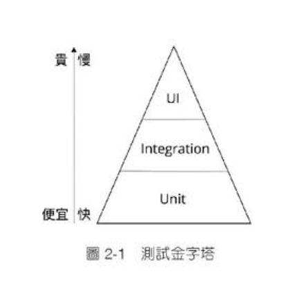

# 2-1 單元測試不是測試

## 自動化與敏捷開發

敏捷開發與測試密不可分。Scrum的Spring產出物，需要符合**潛藏性可交付的產品增量**(不上線也行，要上線也隨時準備好)，若要符合隨時上線的需求，如何快速的將代碼測試一遍是很重要的。   
**沒有自動化測試的敏捷，就只是在搞死QA而已。**

## 自動化單元測試不是測試，是功能

若需要測試的東西太多，來不及寫測試:
1. 減少需求
2. 練習寫快一點

短期內若辦不到的話，所以試著有無加速流程的方法?  
EX:
1. 使用其他工具?
2. 減少準備的時間?
3. 測試流程優化?
不測試的代碼就想不試吃自己料理的廚師
單元測試是RD的工作。


# 2-2 單元測試的起手式:人生第一個單元測試

## 單元測試
林語堂先生曾說:演講就像女人的迷你裙，越短越好。
測試也一樣。
測試方法很多元，但不離三件事:
1. 準備資料
2. 跑起來
3. 檢查結果  
一個測試把這三件事情做完，就是一個Feasible的單元測試。  
通過這個單元測試的代碼，自然就是Feasible的代碼了。

## 範例
```java
public class Student{
    String lastName;
    String firstName;

    public Student(String firstName, String lastName) {
        this.lastName = lastName;
        this.firstName = firstName;
    }

    public String getFullName(){
        return firstName + " " + lastName;
    }
}
```
1. 準備資料 : 製造 Student 物件，其 firstName 與 lastName 分別為 Gary 與 Lin
2. 跑起來 : 呼叫 Student 的 getFullName 方法
3. 檢查結果 : 檢查回傳值是否等於 GaryLin

```java
class StudentTest{
    @Test
    void full_name(){
        Student student = new Student("Gary","Lin");
        String actual = student.getFullName();
        assertEquals("GaryLin",actual);
    }
}
```
這樣哪天有人把 getFullName 方法改壞了這個測試項目就會報錯了。

# 2-3 測試金字塔之 Unit Test v.s. Integration Test
## 測試金字塔
說道單元測試，就不得不提到 Mike Cohn 提出有名的**測試金字塔**
- 測試金字塔  
  
Mike Cohn認為，一個健康的系統，所包含的測試可以包羅萬象，但單元測試應該佔最大篇幅，UI測試應該要最少。
## Unit Test 與 Integration Test
整合測試與單元測試有什麼區別?不同的系統這條界線常常不一樣，但作者希望大家在意的是測試金字塔的**形狀**，抓緊**低階測試多一點，高階測試少一點**的原則，不太需要去計較界線與定義。避免反模式的**測試甜筒**出現，就可以降低測試成本，提高修改性。
## Unit Test 要不要包含DB?
隨著容器的普及，Schema管控工具的進步，現在一台機器造出一個一模一樣的DB已經是幾秒鐘就可以做到的事情。  
1. 建一個新DB
2. 把 Schema 改成指定環境
3. 倒入指定資料
4. 跑測試
5. 整個 DB 刪除  

以上事情對於開發來說不像以前這麼痛苦了。DB相比以前也不會彼此干擾，可以用一模一樣的方式跑測試，所以是否包含 DB 與 **DB Schema 自動化管理做到什麼程度** 有著緊密的關係。