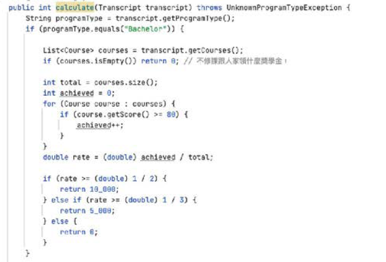
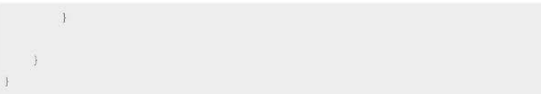
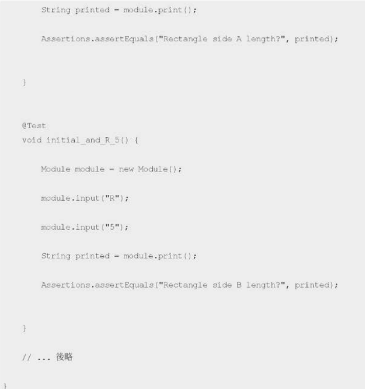
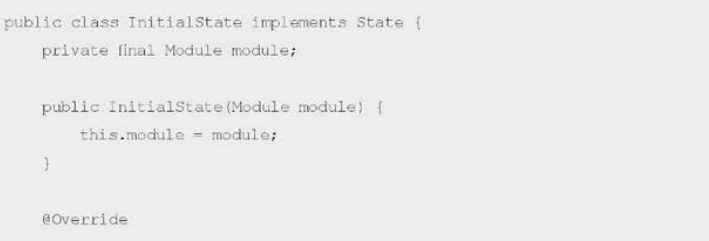

# 5-1萬惡之源---重複（上）：從測試聞出code smell
## 用測試抓出重複  
與其複製貼上，不如直接重複呼叫，或是透過一些重構手法讓它適用在多種不同場景。  
最能減少重複懷味道的方法是密集度夠的單元測試。(程式有何缺陷，寫測試就感受的到)  
當寫測試發現在重複時，可能代表兩件事  
1. 介面設計不好，導致使用者一直做重複的事情。
2. 有很多類似的邏輯，在測試表現出來。

這時候便是重構的好時機了

## 程式重複迫使測試重複：舉個例子

  
一段程式寫得好不好，看「形狀」就知道，如果第一次看不出來，當寫測試時會出現以下方法  

發現三個學生四個場景不停的重複，代表需要重構一下代碼了，接下來開始重構代碼。  

# 5-2萬惡之源---重複（下）：在測試的保護下重構
## 事前分析  
先看看原代碼邏輯  

  
整個calculate方法做了五件事:
1. 從成績單取得學生身份
2. 如果大學生，用大學生公式算獎學金
3. 如果碩士生，用碩士生公式算獎學金
4. 如果博士生，用博士生公式算獎學金
5. 如果都不是，拋錯誤  

一個方法只做一件事，方法太長會導致難以閱讀，先處理方法**太長**這件事
## 提取方法

  
藉由提取三個方法(calculateBachelor、calculateMaster、calculatePhD)，大大的減少閱讀。
## 委託
處理一個方法只做一件事的問題。

現在要修改各類獎金的方法，只要動該類型的實作類別就好，原本的service是完全不用動的。
## 抽取介面
目前還是違反開放封閉原則(如果加個在職專班還是得進來改這個方法)，故
1. 依照學生類別找到對應的計算方式
2. 回傳計算機處理的結果

 

抽了Calculate這個介面，原本三個計算工具也都變成Calculate。
## 將程式改寫成符合高階抽象邏輯的寫法
將Calculate這個方法，正式改成符合依照學生類別找出對應計算出回傳結果。

   
# 5-3可惡想要：Feature Envy
## Feature Envy(依戀情結)  
函式對於某個Class的興趣高過對自己所處Class的興趣就可稱為Feature Envy。
## 解決之道
當發現A方法對B的Feature有異常的Envy，就該將該方法轉去B了。
## 舉例
從剛剛的例子用算碩士生獎學金的方法看看。

可以看到calculate方法有大半篇幅都跟Transcript的資料溝通。如何抽取第一步可以藉由提取方法將每段邏輯隔開

抽出來後發現calculateWeightAverage跟hasNoCourses方法從頭到尾跟Transcript的courses互動而已，故搬移至Transcript。

現在只需要跟Transcript要取最終運算結果就好了，其他細節不需要管。
# 5-4難兄難弟：Data Clump與Primitive Obsession
代碼中很常出現破壞代碼品質的兩個行為，Data Clump與Primitive Obsession。
## Primitive Obsession(基本型別偏執)
在程式碼撰寫過程中，過度依賴語言所提供的基本型別（例如整數、字串、布林值等）來表示某些包括業務邏輯的概念或實體。

例如，新手可能會很直觀地選擇分別使用字串與浮點數來儲存貨幣單位與金額欄位，而不是創造一個新的貨幣類別（Money Class）來整合所有與貨幣有關的商業邏輯與行為。
## Data Clump(資料泥團)
如果我們在程式中發現一組相關的資料總是同時出現，而且當我們拿掉其中一個資料時，會讓剩下的部分失去意義或不完整時，這就是資料泥團（Data Clumps）的徵兆。

例如，當我們要描述一個「點」在三維空間中的位置時，三維坐標的數值必須同時存在、缺一不可，否則這個「點」的資料就失去了意義。
## 解決之道  
當出現時，建議創立一個物件包裝起來。如果這個物件出現在介面，我們就把它稱為Parameter Object。
## 舉例
當現在有一個線上簽到的功能，學生上課點一下簽到系統便自動簽到，需要一個點擊簽到檢查學生地理位子並打卡的功能。

寫完後添加上測試

測試寫完發現要用非常多的數字，代表這段代碼的可讀性是不佳的，開始重構。

## 出現了！其他壞味道
這邊出現了Message Chains(A物件要完B物件，再跟B物件要C物件...以此類推)跟Feature Envy(distanceCalculator只做跟position有關的)
至於平衡點就取決於開發者，反正哪怕到時候需要重構也有測試保護。
# 5-5不殘而廢：Data Class
物件與物件需要方法去連結，這時常見的方法會在另外一個類，加入與這些資料相關的操作以完成任務。  
只有Data的Class，明明四肢健全卻限制自己只能裝資料，還需要其他人協助才可以動的物件。
## 舉例

## 解決之道
將該方法直接搬移至物件上既可。
## 「只有資料的物件」一定有Data Class壞味道嗎？
不一定，還得搭配放在其他地方的行為才算數。
## 延伸思考題
Data Class 壞味道，是不是容易進一步造成Feature Envy?為什麼?
# 5.6一切皆空：Null
## 常見的Null發生場景
方法內部、接口input、接口的output。
## 為什麽回傳Null是個壞味道？
1. 語意不明
2. 重複程式碼

語意不明，無法定義這個Null背後代表真正的意義。  
重複程式碼，需要針對這個Null寫許多的if判斷。
## 解決之道
使用
1. Optional :當Optional放在output，代表告訴對方這可能是空值，需規劃Null該怎麼辦，沒有Optional的地方就不會有Null。
2. Collection :回傳空List比Null還好
3. Null Object :通常使用在**多型**的場景。
4. Exception :直接告訴對方當某個物件不存在是一種**錯誤**，對方自行決定如何處理。
## 舉例
找C++分數最高的同學，發信請他們來領獎金

repository提供找尋最高分同學的List，Service直接最對應的策略
1. 只有一位最高分 :發信給一個同學
2. 有兩位以上同分 :發信給所有該分數同學
3. 沒有人修這門課 :不發信

以上三種情況既可以應付所有情況，且只需要一個for-loop可以跑完。  
最後還是得寫個測試確認代碼品質。

# 5-7聽從你的蜥蜴腦：If
## if 為什麼是壞味道?
主要體驗於SRP(Single Responsibility Principle)的破壞，一個方法如果太多邏輯路徑，就代表做了太多的事情了。例如:如果下雨就待在家，不然就出門，這句話就同時做了待在家跟出門，直接違反單一職責原則。  
不是所有的if都非修改不可，譬如**衛語句**是解決巢狀式的模式。  
- Switch Case也算是一種變相if-else
## 解決之道
常見的解法是改採State或是Strategy設計模式，或是抽個介面，用多型方法解決。但若違反SRP情節不嚴重，分別使用更精確方法就挺好用的了。  
譬如一個if-else有兩個可能性，直接拆成兩個只做一件事情的方法也是個不錯的選擇。
# 5-8在測試保護下重構出State設計模式
## 題目：Console Interaction
需要計算周長及面積。系統先問使用者算矩型還是圓型，再依使用者輸入決定下一個問題，算出該圖型周長與面積。
## 分析：隱藏的陷阱
設計時需要把介面與核心邏輯拆開，讓之後切換使用者介面時均不影響核心邏輯。
## 開工：先用醜方法完成功能

## 暫停！聞聞壞味道
發現每次User Interface與Module互動的if太多了，繼續寫下去重構成本會太高。還沒將Circle放進來print跟input就要做一堆事情，明顯違反單一職責原則。  
另外，input方法中字串處理邏輯也重複了。
## 重構：決定策略再動手
Module的資料與狀態綁在一起了，狀態又與狀態對應邏輯分開，Module被呼叫時，該怎麼處理該是什麼狀態應該被抽走，Module只要負責**放一個狀態在身上就好**，正是使用狀態模式的場景。
再來就是一步一步去除壞味道，重構並不等於重寫。
分析發現以下特徵
1. Module必須提供input跟output方法
2. 不同狀態下的input與output行為不同
3. 就算未加入Circle上述兩點不變

歸類:input與output是狀態的工作，現在卻是module在做。
## 第一步：把重複直接暴露出來
先將input與print藉由status暴露出重複的部分

## 第二步：把同status的功能放在一起
將同status的input與print寫在一起，增加擴展性及可讀性。
1. print的initial邏輯，用extract method抽成方法printInitial保護
2. input的initial邏輯，用extract method抽成方法inputInitial保護起來
3. printInitial與inputInitial抽出去給新類別InitialState
4. 方法改名為input與output

變成以下代碼  

其他三個狀態同步

## 第三步：以State類别取代status字串
繼續分析現在的Module，發現以下特徵
1. 不管是input還是output，都會依status的值，找到對應的state物件
2. state與status是一對一物件

既然一樣是不是可以取代掉?
1. 讓四個不同的state實作同一個State interface
2. 讓Module只有一個State實體

## 驗收：確認重構後的可擴展性
狀態模式完成

若要新增Circle邏輯，就要新增兩個狀態CircleSelectedState、CircleRSelectedState。  
修改原有狀態InitialState。

新增兩個State

新增Circle測試

## 結論
**設計模式是重構出來的，不是規劃出來的。**
