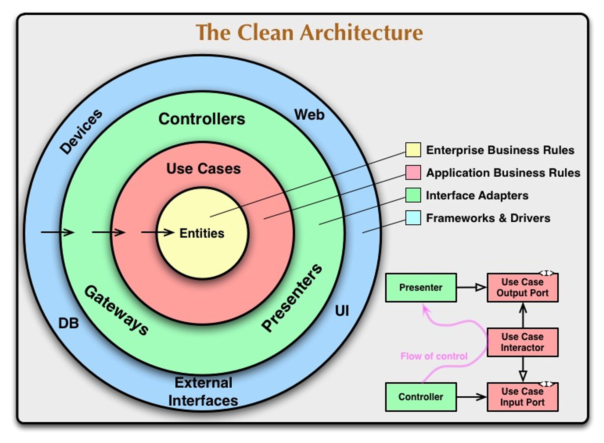
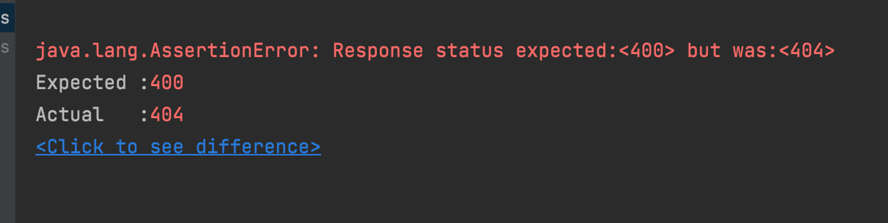
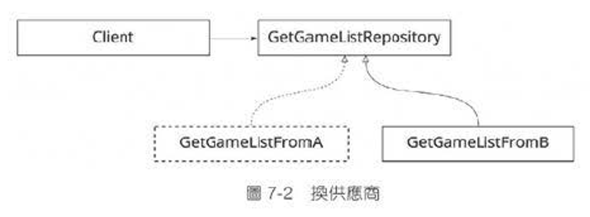
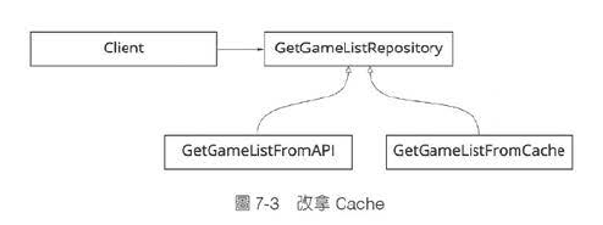
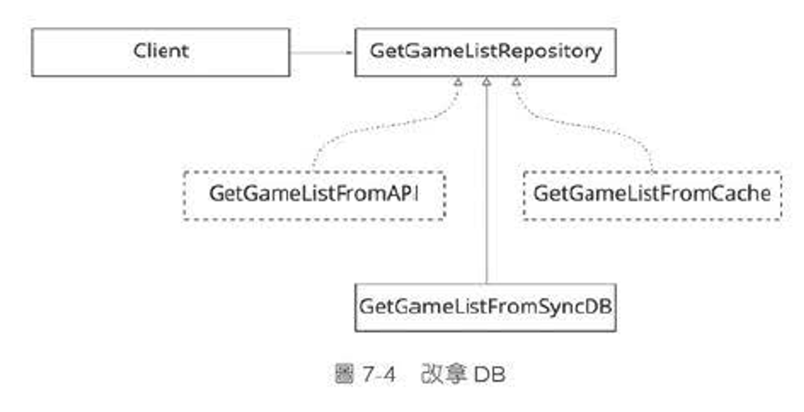

# Clean Architecture 簡易入門

## 簡介

Clean Architecture 是 Uncle Bob 在 2017 年初的一本關於「架構」的書

在此之前也有許多關於架構的書籍

Uncle Bob 經過比較後，覺得重點有三個：

### 1. 分離框架

框架只是工具，應該隔離於核心邏輯之外

### 2. 可以被測試

核心邏輯獨立於 UI、資料庫、網路…等細節，方便抽換測試核心邏輯

### 3. 獨立於資料庫

把 Oracle 換成 MySQL、Mongo … 等，都不會破壞系統本身

於是 Uncle Bob 綜合了以上優點加上自己的想法，提出 Clean Architecture 這個架構

這個架構分成四層，並且是由外而內排

排序的依據是「越細節的越外面，越核心的越裡面」

如下圖



## 分層介紹

### 1. Entities

核心業務、重要資料的所在地，在問題領域中一定要做的事情

### 2. Use Cases

包圍在 Entity 之外的一層，定義「核心邏輯和資料」的「使用時機和操作順序」

### 3. Interface Adapters

系統的邊界，主要任務為：

1. 取得請求內容，轉換成內部認識的樣貌
2. 並執行適當的 Use Case 任務
3. 將資料轉換成外界認識的樣貌回去

由於幾乎都是在做轉換的工作，故名 Interface Adapter

### 4. Frameworks & Drivers

系統中最細節的部分，例如：網路、檔案、資料庫、人機介面…等

離 I/O 越近的越細節，在外層

離 I/O 越越的越核心，在內層

## 三大原則

Clean Architecture 討論了很多設計上的注意事項

其中有三大原則：

1. 分層原則：系統元件要分層放置，不要亂放
2. 依賴原則：依賴要「由外而內」，否則會關係亂掉，造成耦合
3. 跨層原則：外層只認識同一層或往內一層的元件，不能跨兩層

### 依賴原則的挑戰

上面三大原則中的依賴原則說，不能由內往外依賴

那 Use Case 要操作 Entity，但 Entity 資料放在 DB 時，該怎麼控制資料庫

就是使用依賴反轉原則 (Dependency inversion principle，DIP)

業務邏輯不應該依賴資料實作，應該使兩方共同依賴一個抽象介面

舉例來說

內層的 Use Case 不應該認識外層的 Repository

所以這時 Use Case 應該要定義一個 Repository 的抽象介面

然後這個介面的實作，會放在 Interface Adapters 層

### 跨層原則的重要性

遵守跨層原則是麻煩的一件事，例如：

Adapter 層只能認識 Use Case 層的物件，不會知道 Entity 層

所以如果前端想要知道的資料格式和 Entity 層完全一樣，也不可以直接傳出去

可以選擇在 Use Case 層轉一下物件

或套用 CQRS 模式，跳過 Use Case 層，和同一層的 Repository 合作，回傳客製化物件

這樣設計的主因是，不要讓核心業務被外層的細節干擾

# CA 的真實案例

用「申請獎學金」當作例子

***表 7-1：現實角色和各層責任如下***

| 登場人物 | 任務 | 物件名 | 分層 |
| --- | --- | --- | --- |
| 工讀生 | 詢問來者意圖，初步檢查文件完整性
為其帶路，找到合適的專員 | ApplyScholarshipController | Adapter |
| 申請書 | 寫著申請資料，專員審核時可以參考 | ApplicationForm | UI/Adapter |
| 「獎學金申請」專員 | 控管流程，根據申請書的資料，向檔案管理員索取資料，依規定審核後填寫正式記錄 | ApplyScholarshipService | Use Case |
| 檔案管理員 | 依專員需求，找出資料或儲存資料 | ScholarshipRepository | Use Case / Adapter |
| 「獎學金申請」正式記錄 | 記載此申請的官方資料與核心運算(如有需要) | ScholarshipApplication | Entity |
| 檔案櫃 | 存放檔案 | - | DB |

接下來的小節，會從 Interface Adapter 開始，一層一層的往下實作和測試

# Controller 與單元測試

## 列**測項**

TDD 的第一步，作者建議先列出可能遇到的場景

這個表不是規定，可能會隨著開發的時候進行修改

***表 7-2：Controller 的測項***

| 測項 | 結果 |
| --- | --- |
| 學生不存在 | 400 |
| 獎學金不存在 | 400 |
| 資料存取錯誤 | 500 |
| 其他異常 | 500 |
| 成功 | 200 |

## 測項一：學生不存在

這是一個 Controller

任務是「轉換」前端送來的申請單，找到合適的 Service 方法

最後把結果或錯誤回傳給前端

### (1) 寫測試，亮紅燈

寫得醜沒關係，最後會重構

***程式 7-1***

```java
@Test
void student_NOT_exists() throws Exception {

    ApplicationForm applicationForm = new ApplicationForm(
            9527L,
            55688L
    );

    ApplyScholarshipService applyScholarshipService = Mockito.mock(ApplyScholarshipService.class);
    Mockito.doThrow(new StudentNotExistException("ANY_MESSAGE"))
            .when(applyScholarshipService)
            .apply(applicationForm);

    MockHttpServletRequestBuilder request = MockMvcRequestBuilders
            .post("/scholarship/apply")
            .contentType(MediaType.APPLICATION_JSON)
            .content(objectMapper.writeValueAsString(applicationForm));

    mockMvc.perform(request)
                .andExpect(status().is(400))
                .andExpect(content().json(objectMapper.writeValueAsString(ApiResponse.bad(987))));

}
```

寫完後執行測試，應該會出現 404 錯誤



### (2) 寫程式，亮綠燈

只寫最少的程式碼，讓測試通過

***程式 7-2***

```java
@PostMapping("/scholarship/apply")
public ResponseEntity<ApiResponse> apply(@RequestBody ApplicationForm applicationForm) {
    return ResponseEntity.status(400).body(ApiResponse.bad(987));
}
```

### (3) 重構

重構時要同時考慮程式和測試

這裡程式只有一行，不需要重構

但是測試太醜了，因此就要重構

***程式 7-3***

```java
@Test
void student_NOT_exists() throws Exception {

    assume_student_not_exist(9527L);

    mockMvc.perform(request(
                    "/scholarship/apply"
                    , application_form(9527L, 55688L)))
            .andExpect(status().is(400))
            .andExpect(content().json(bad_response_content(987)));
}
```

## 測項二、三、四：省略

接下來每個測項都是依造上面的順序來開發

1. 寫測試，亮紅燈
2. 寫程式，亮綠燈
3. 重構

中間測項二、三、四就跳過，直接進入測項五

測項二：獎學金不存在

測項三：資料存取錯誤

測項四：其他異常

## 測項五：成功

### (1) 寫測試，亮紅燈

***程式 7-14***

```java
@Test
void all_ok() throws Exception {
    mockMvc.perform(request(
                    "/scholarship/apply"
                    , application_form(9527L, 55688L)))
            .andExpect(status().is(200))
            .andExpect(content().json(
                    objectMapper.writeValueAsString(ApiResponse.empty())));
}
```

### (2) 寫程式，亮綠燈

只寫最少的程式碼，讓測試通過

***程式 7-15***

```java
@PostMapping("/scholarship/apply")
public ResponseEntity<ApiResponse> apply(@RequestBody ApplicationForm applicationForm) {
    try {
        applyScholarshipService.apply(applicationForm);
    } catch (ClientSideErrorException e) {
        return ResponseEntity.status(400).body(ApiResponse.bad(e.getCode()));
    } catch (DataAccessErrorException e) {
        return ResponseEntity.status(500).body(ApiResponse.bad(666));
    } catch (Exception e) {
        return ResponseEntity.status(500).body(ApiResponse.bad(999));
    }

    return ResponseEntity.status(200).body(ApiResponse.empty());
}
```

### (3) 重構

由於前面的測項時，就重構了大部分的架構

因此在這個測項，沒有動到程式架構，也幾乎不用重構

## 小節

本節演示了用 TDD 的方式，一步步建構後端 API 服務的門面：Controller

Controller 位於 CA 的 Interface Adapter 層，直接和最外層的 Framework 與 Internet 相接

這次層很難完全與 Framework 隔絕

但後面的 Service 層就應該開始隔絕了

越是核心的元件，就越要遠離框架

# Service 與單元測試

在做完 Controller 後，Service 的接口樣貌，應該已有了很大的確定性

在 CA 的分層裡， Service 所在的 Use Case 層，是為了 Controller 層存在的

Service 接下來要做的事是

「想辦法根據 Controller 給的資料，完成該做的事，並在需要時通知 Controller」

## 列測項

列出測項前，可以先條列出 Service 要做的事：

1. 調閱學生資料
2. 調閱獎學金規定的資料
3. 查驗是否符合資格
4. 填寫正式申請書
5. 存檔

接著在整理出邏輯分支的地方，就可以列出測項

***表 7-3：Service 層的測項***

| 測項 | 行為 |
| --- | --- |
| 找不到學生資料 | Exception 987 |
| Repository 取得學生資料時發生錯誤 | Exception 666 |
| 找不到獎學金資料 | Exception 369 |
| Repository 取得獎學金資料時發生錯誤 | Exception 666 |
| 資格不符 | Exception 375 |
| Repository 儲存資料時發生錯誤 | Exception 666 |
| 成功 | void |

## 測項一：成功

### (1) 寫測試，亮紅燈

一樣寫得醜沒關係，最後會重構

***程式 7-16***

```java
@Test
void all_ok() throws DataAccessErrorException, ClientSideErrorException {

    StudentRepository studentRepository = Mockito.mock(StudentRepository.class);

    ApplyScholarshipService applyScholarshipService
            = new ApplyScholarshipService(studentRepository);

    ApplicationForm applicationForm
            = new ApplicationForm(12345L, 98765L);

    applyScholarshipService.apply(applicationForm);
}
```

寫完後執行測試，應該會出現錯誤

### (2) 寫程式，亮綠燈

只寫最少的程式碼，讓測試通過

畢竟沒有回傳值，只要不出錯就會成功了

因此甚至可以什麼都不寫

***程式 7-17***

```java
public void apply(ApplicationForm applicationForm) throws ClientSideErrorException, DataAccessErrorException {
    // 調閱學生資料
    // 調閱獎學金規定的資料
    // 查驗是否符合資格
    // 填寫正式申請書
    // 存檔
}
```

### (3) 重構

但是測試有點醜，但作者覺得還可以忍一下

等下一個測項做完，確定哪部分是重複的，再來重構

## 測項二：找不到學生資料

### (1) 寫測試，亮紅燈

一樣寫得醜沒關係，最後會重構

***程式 7-18***

```java
@Test
void when_student_not_exist_then_987() {

    StudentRepository studentRepository = Mockito.mock(StudentRepository.class);
    Mockito.when(studentRepository.find(12345L))
            .thenReturn(Optional.empty());

    ApplyScholarshipService applyScholarshipService
            = new ApplyScholarshipService(studentRepository);

    ApplicationForm applicationForm
            = new ApplicationForm(12345L, 98765L);

    ClientSideErrorException actualException = Assertions.assertThrows(ClientSideErrorException.class,
            () -> applyScholarshipService.apply(applicationForm));

    Assertions.assertEquals(987, actualException.getCode());
}
```

寫完後執行測試，應該會出現錯誤

### (2) 寫程式，亮綠燈

只寫最少的程式碼，讓測試通過

畢竟沒有回傳值，只要不出錯就會成功了

因此甚至可以什麼都不寫

***程式 7-19***

```java
public void apply(ApplicationForm applicationForm) throws ClientSideErrorException, DataAccessErrorException {
    // 調閱學生資料
    studentRepository.find(applicationForm.getStudentId())
            .orElseThrow(() -> new ClientSideErrorException("cannot find student", 987));

    // 調閱獎學金規定的資料
    // 查驗是否符合資格
    // 填寫正式申請書
    // 存檔
}
```

### (3) 重構

前一個測項做完沒有重構，是為了確定哪部分是重複的

因此這次可以一次重構兩個測項

***程式 7-20***

```java
@Test
void all_ok() throws DataAccessErrorException, ClientSideErrorException {

    given_student_exists(12345L);

    when_apply_with_form_then_NO_error(application_form(12345L, 98765L));
}

@Test
void when_student_not_exist_then_987() {

    given_student_NOT_exists(12345L);

    when_apply_with_form_and_error_happens(application_form(12345L, 98765L));

    then_error_code_is(987);
}
```

## 測項三、四、五：省略

差不多的東西，省略，有興趣再去看

測項三：Repository 取得學生資料時發生錯誤

測項四：找不到獎學金資料

測項五：Repository 取得獎學金資料時發生錯誤

## 長大的測項

原本一開始列了七個測項，現在已經完成了五個

所以理論上應該剩兩個測項

但測項是有可能長大的

當寫的程式越多，對事情了解的也越多

就可能會發現一些原本沒想到的問題

這時候就要加測項

| 超過申請時間 (新的) | Exception 374 |
| --- | --- |
| 資格不符 | Exception 375 |
| Repository 儲存資料時發生錯誤 | Exception 666 |

## 測項六、七：省略

差不多的東西，省略，有興趣再去看

測項六：超過申請時間 (新的)

測項七：資格不符

## 測項八：Repository 儲存資料時發生錯誤

### (1) 寫測試，亮紅燈

一樣寫得醜沒關係，最後會重構

***程式 7-38***

```java
@Test
void when_DB_fail_on_writing_application_to_DB_then_666() throws RepositoryAccessDataFailException {

    given_student_exists(12345L, "PhD");

    given_scholarship_exists(98765L, scholarship());

    given_today_is(july31);

    Mockito.doThrow(new RepositoryAccessDataFailException())
            .when(applicationRepository).create(any(Application.class));

    when_apply_and_fail_on_server_side(application_form(12345L, 98765L));

    then_server_side_error_code_should_be(666);
}
```

寫完後執行測試，應該會出現錯誤

### (2) 寫程式，亮綠燈

***程式 7-39***

```java
 public void apply(ApplicationForm applicationForm) throws ClientSideErrorException, ServerSideErrorException {

    // 調閱學生資料
    Student student = findStudent(applicationForm);

    // 調閱獎學金規定的資料
    Scholarship scholarship = findScholarship(applicationForm);

    // 查驗是否符合資格
    checkDeadline(scholarship);

    // 查驗是否符合資格
    checkProgramIsPhD(student);

    // 填寫正式申請書
    Application application = applicationForm.toApplication();

    // 存檔
    try {
        this.applicationRepository.create(application);
    } catch (RepositoryAccessDataFailException e) {
        throw new ServerSideErrorException("failed to create application", 666);
    }
}
```

### (3) 重構

這裡測試和程式都重構了

***程式 7-40***

```java
public void apply(ApplicationForm applicationForm) throws ClientSideErrorException, ServerSideErrorException {

    // 調閱學生資料
    Student student = findStudent(applicationForm);

    // 調閱獎學金規定的資料
    Scholarship scholarship = findScholarship(applicationForm);

    // 查驗是否符合資格
    checkDeadline(scholarship);

    // 查驗是否符合資格
    checkProgramIsPhD(student);

    // 填寫正式申請書
    Application application = applicationForm.toApplication();

    // 存檔
    createApplication(application);
}
```

***程式 7-41***

```java
@Test
void when_DB_fail_on_writing_application_to_DB_then_666() throws RepositoryAccessDataFailException {

    given_student_exists(12345L, "PhD");

    given_scholarship_exists(98765L, scholarship());

    given_today_is(july31);

    assume_DB_would_fail_on_creating_application_data();

    when_apply_and_fail_on_server_side(application_form(12345L, 98765L));

    then_server_side_error_code_should_be(666);
}
```

## 小節

這個小節是在描述 CA 中，位於 Use Case 層的 Service，如何進行它的工作

並且使用了 TDD 的方式，來一步步建構出完整邏輯

# Entity 與單元測試

CA 裡的 Entity 負責系統最核心的邏輯

資料庫可以儲存資料，對系統來說，只是存放東西的地方，只是「重要的細節」

所以用 DB Table 決定 Entity 樣貌是不合理的

應該由「Domain Model」來決定比較合適

在 CA 中，需求工作被定義為 Use Case

在 Use Case 實現的過程中，會對參與角色有一些期待

例如：期待提供一些資料，期待做一些事情，這些「期待」定義了 Entity 該做的事

## **重構出好用的 Entity：檢查 Deadline**

之前的申請獎學金的 Service 有一個壞味道：Feature Envy

其中 `checkDeadline` 和 `checkProgramIsPhD` 的邏輯都放在 Service 中

***程式 7-42***

```jsx
private void checkDeadline(Scholarship scholarship) throws ClientSideErrorException {
    LocalDate deadline = scholarship.getDeadline();
    LocalDate now = LocalDate.now();
    if (now.isAfter(deadline)) {
        throw new ClientSideErrorException("application over time", 374);
    }
}

private void checkProgramIsPhD(Student student) throws ClientSideErrorException {
    if (!student.getProgram().equals("PhD")) {
        throw new ClientSideErrorException("this scholarship is for PhD students only", 375);
    }
}
```

但作者覺得這兩個邏輯應該給 `Scholarship` 自己來定義

因此利用 Move Method 的手法，把這兩個工作搬到 `Scholarship` 中

***程式 7-43***

```jsx
private void checkDeadline(Scholarship scholarship) throws ClientSideErrorException {
    if (scholarship.checkDeadline()) {
        throw new ClientSideErrorException("application over time", 374);
    }
}

private void checkProgramIsPhD(Scholarship scholarship, Student student) throws ClientSideErrorException {
    if (!scholarship.checkQualification(student)) {
        throw new ClientSideErrorException("this scholarship is for PhD students only", 375);
    }
}
```

一般 CA 初學者最常搞混 Use Case 和 Entity 的權責

單就「檢查資格」來看，工作分別是：

- Entity：根據 Domain Model 的定義，檢查 `Student` 是否符合資格
- Use Case：在適當時機叫 `Scholarship` 檢查

直到現在，開發都已經快結束了，都還不需要決定 DB 的樣貌，CA 就是這樣

在思考主要邏輯和流程時，不應該考慮 DB 要長什麼樣子

「延遲決定」也是敏捷開發重要的手段之一

當這些技術細節拖延到最後才決定，由於已經有更多的理解，決策也往往會更正確

# Repository 與單元測試

在系統中擔任「檔案管理員」的 Repository

如果資料放在 DB，它就去操作 DB

如果資料放在第三方 API，它就去操作第三方 API

它就是一個「為 Service 服務，代替 Service 處理 I/O 細節」的無名英雄

在 Controller、Service、Entity 都完成後，我們就知道該怎麼設計它了

## DIP 和 Repository

Repository 身為「檔案管理員」

根據 CA 的規劃，應該放在 Interface Adapter 層，直接與框架和 I/O 接觸

但 Service 身處較內層的 Use Case 層，想要操作 Repository

但直接呼叫就會違反「依賴原則：內層不依賴於外層」

這時就要用依賴反轉原則(DIP，Dependency Inversion Principle)

Service 是需求方，直接要訂好一個介面，讓身在外層的 Repository 去實作

而這個介面本身則與 Service 一起放在 Use Case 層

## 案例研究：多次切換 Data Source

作者某次的工作經驗是某遊戲公司，資料來源是某個廠商 A 介接 API

然後就開始開發遊戲了，最後後面換過三次的 Data Source

### 1. 更換 API 供應商

由於廠商 A 的資料不齊全，服務也不穩定，因此決定換另一個廠商 B

這時作者是這樣設計的

1. 先抽一個 Interface 出來，原本廠商 A 的 Repository 要實作這個 Interface
然後「**新增一個廠商 B 的 Repository**」，也要實作這個 Interface
2. 所有 Interface 都準備好後，在修改設定，直接改注入新的實作

至於 Client 方 (不是真實的使用者，而是指呼叫方) 完全不用修改，也沒發現有換實作



### 2. 實作 Cache

隨著開發進度的推進，開始要優化反應速度，因此打算加 Cache

大部分的人會直接加進原本的 Repository 裡面，作者一開始也這樣

但最後發現「測試太難寫了，要考慮太多場景」

所以最後作者一樣「**新增一個 Cache 管理者**」，去實作同一個 Interface

這裡面會決定何時會從 Cache 拿資料，何時又會跟 API 拿資料

要注意的是 Cache 和原本的 API 實作互相並不認識

Cache 實作的時候如果找不到資料，只知道要跟身上的另一個 Repository 拿資料

但是並不知道是 API 實作的版本還是其他版本

至於 Client 方一樣完全不用修改



### 3. 改成 DB

後來由於 API 次按次數收費

為了節省成本，也可以將一些不太會變動的資料，改由存放在 DB 裡

在這個場景下，Client 方一樣可以得到資料



以上三個場景，都只是資料來源的改動，並沒有包含商業邏輯

因此最好的情況就是指在 Adapter 層解決，不要動到 Entity 和 Service

# Clean Architecture ft. CQRS

## **命令查詢職責分離模式**

Ajay Kumar 在 2019 年出的 CQRS 一書中，建議把系統的指令分成

1. 不會改變系統狀態的「查詢（Query）」
2. 會改變系統狀態的「命令（Command）」

以教務處網站系統為例，「獎學金列表」就是一種查詢，「申請獎學金」就是一種命令

由於查詢指令不會改變系統狀態，而且經常會改動

所以不需要出動 Entity 和 Service，只要 Controller 直接呼叫特定的 Repository 去查就好

除了流程上變得比較簡單之外

因為 Entity 沒有參與流程，前端需求的變動，並不會動到系統核心的 Entity 設計

## **CQRS 的副作用：假性重複**

在 Query 時，因為不用走進 Service

Controller 會跟 Repository 要求一個特製的物件，當作回傳格式

在不失語意的假設下，我們先稱之為 VO

VO 與 Entity 在系統開發初期可能長得很像

例如查詢獎學金列表時，Controller 很可能需要撈出跟 Entity 一模一樣的東西

如果此時 Controller 回的是 Entity，會有兩個壞處

1. 違反了 Clean Architecture 的跨層原則
2. 系統的核心 Entity，會隨著最外層的 UI 快速變化 (前端畫面變動得很快)

因此這裡不可以直接拿 Entity 去回傳

這裡的 VO 與 Entity 長的很像，只是一種「假性重複」

這種重複不會致命，隨著 UI 慢慢改變，這些 VO 會各自演化，最終會長得不一樣