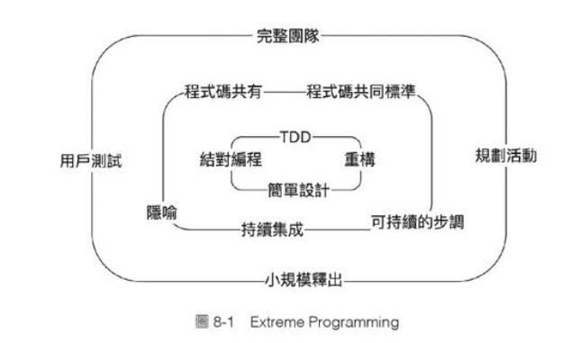

# 8.1 單元測試與Git Flow、主線開發
## 聊Git分支策略，先從敏捷開發開始
- 需求不斷改變，身處在天天變化的場合，就有義務要「隨時保持產品是對的」，並所有人都相信你是對的，接下來才能在對的Code Base上加東西
- 這時單元測試與好的分支管理策略就很重要

## Git Flow
- develop
- feature
- master
- release
- hotfix

## 主線開發
- 這是一種開發模式，將所有的功能都放在主線上，這樣可以確保所有的功能都是最新的，並且可以避免分支合併的問題
- 同時更簡單自由

## 再回到敏捷開發
- 不論哪種開發方式，使用者習慣不好，都會有衝突的問題
- 作者提到不管哪種策略，都要保持「瘦」的原則
- 重要觀念：「有merge就要跑全測試」

## 策略只是模式，改變只是過程
- 這小節作者提出了問題場景的變更，並依照不同場景切換策略
- 「重點不在哪個分支策略最潮最敏捷，而是有沒有感知身邊的Force, Context，並不斷想辦法解決當下最重要的問題。」

# 8.2 單元測試與軟體工程
## 導入Extreme Programming

- 圖8-1 Extreme Programming Explained實踐後的分門別類
  - 內層：「工程實踐」
  - 中層：「團隊協作」
  - 外層：「流程改善」
- 作者提到Ron Jeffries在XP中説：「不太可能一口氣開始所有實踐，那會扼殺一個團隊的所有精力」
- 不要導入XP，要在適當的時機，拿來解決工作上的瓶頸
## 導入Scrum
- Scrum三本柱：「探索、調適、透明化」
- 每個Sprint結束後都要得到「Potentially Shippable」的功能：幾乎可以上線的功能，也就是要通過測試
- 如果隨著產品長大，而沒有自動化測試，依然依賴QA手動測，那就會失去意義，不如一口氣做完，QA一口氣測完
- 所以，不要導入Scrum，要在適當的時機，拿來解決工作上的瓶頸

## 導入Kanban 
- 工作「流」的管理很重要，要避免結束的工作又再次「回流」
- 在工作上下由邊界處講好「何謂完成、何謂驗收通過」，如果上游都能做好檢查，就自然能減少下游回流的可能
- 看板方法需要管理流動，管理流動要避免回流，避免回流要靠「自動化單元測試」
- 不要導入Kanban，要在適當的時機，拿來解決工作上的瓶頸

## 導入CI/CD與DevOps
- CI/CD同樣建立在自動化測試的基礎上，要高度自動化得要有好的測試
- 不要導入CI/CD，要在適當的時機，拿來解決工作上的瓶頸

## 導入User Story
- 不要導入User Story，要在適當的時機，拿來解決工作上的瓶頸

## 導入單元測試
- 不要導入單元測試，要在適當的時機，拿來解決工作上的瓶頸

## 不要再「導入」了
- 該做什麼就去做，有問題就修正

# 8.3 單元測試的反模式
## 有空再寫測試

## 讓QA寫單元測試
  - 為什麼不行？ 解決用戶提出的方法得做兩件事：
    - 1. 提出解決問題的方案
    - 2. 實現該方案的程式 
  - QA該專注的是檢查解決方案與問題之間對應關係，也就是「提出的方案有沒有解決用戶問題」
  - RD專注的是實現該方案的程式是否正常運作

## 讓測試互相依賴
  - 為什麼不要讓測試互相依賴？ 原因有三
    1. 互相依賴的測試，代表沒完整表達一個商業概念
    2. 測試間依賴會使修改測試時要考慮的事變多
    3. 你不會永遠用同一套Unit test框架，至少不會永遠用同一版

## 寫出不好懂的測試
- 可參照第六章程式6-4、程式6-8

## 關於維護
### 讓測試變成次等公民
### 同時改程式與測試
- 「測試的測試就是程式本身」
- 程式與測試一定不能同時修改，一定要先改期中一個，跑測試，看是否失敗，並且是要預想中的失敗樣式，才能去改另一個
- 很難實現嗎？ 採用TDD吧

## 關於執行
### 不天天跑測試
### 錯了不馬上修好
### 放任測試執行過久