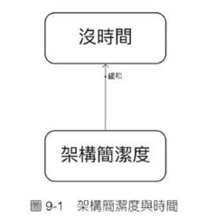

# 9.1 動態系統中的單元測試  
軟體開發工作中，一個現象往往是由不同原因共同施力造成，而解方往往會改變原系統的作用力，引發後續效應。身處在一個**動態**的系統，任何一個改動都會牽扯到整個系統的變動。面對眼前的問題，往往需要考慮該解方會影響到系統的哪些部分。

因此本章節將試圖定義眼神遇到的問題，並列出一些可能的解方
## 定義問題:「沒時間」
RD最常表示的一句話，**可以做，沒時間**。

## 分析原因: 架構不好
**代碼品質不佳，維護成本過高**  

老闆需求總是朝令夕改，代碼需要有很好的改動性，面對各種需求就可以大大減少時間，於是有了以下的圖片

但再好的代碼，面對一次次的修改難免會亂，如果不好好維持代碼品質，不久的將來就得面對重構(根本是重寫!)。  
所以要在原本的圖片中，增加了一個可以促進系統架構簡潔度的元素，形成一個**平衡迴路**，並且因素最好是能從時間推導出來，才能形成自己推動自己的循環迴路，讓問題不再出現。

## 根本解: 單元測試
答案正是「單元測試」，讓每次修改都可以方便快速，舊代碼有必要修改時，就是補測試，在測試保護下重構的時候了。

問題來了，一次次的修改慢慢調整架構，是需要時間與能力的累積，很難快速地看到結果，圖片9-3中的Delay就是在說這件事。

## 症狀解: 人工驗測
直接找專人來測試，分擔RD原本的測試工作，工作少了，時間自然多了，直接最快速的方法。

## 影響一:捨本逐末
由於時間多了，老闆需求跟著增加，久而久之，一開始因為沒時間將測試分給QA，雖然緩解了一時沒時間的問題，卻產生了更大的連鎖效應，讓沒時間的問題更嚴重了。

## 影響二:引鳩止渴
那就多請幾個人?

不行讓QA用手動的方式去做原本該讓程式自動化測試的部分。

因為Unit Test 執行時間通常只需要幾秒鐘至幾分鐘，但如果由QA去測試常常需要考慮更大的範圍，測試幾天幾週後，開發已經忘了差不多了。

再來因為人為檢測通常是End-to-End，一但出了錯需要檢查的範圍也會比較大，修復時間自然會延長，更加導致沒時間的問題。

名為引鳩止渴的另外一個基模，為了解決一個問題引用一個解方，短期雖有效，長期卻會有反效果。

## 管理作為:動作要早，動作要小
趁早拉高測試占比，不讓過多的人工檢測有機會擴大對自動測試的傷害，動作不能太大(如一個月內100%涵蓋率)，以免造就其他不可控因(改變開發習慣、內容影響反彈)。

# 9.2 最初也最終
## 快速回顧
有了測試保護，以前不敢做的「重構」敢做了，也能快速的藉由「壞味道」發現品質不好的代碼，介紹了「倫敦派」與「芝加哥派」的TDD，聊了最近很紅的Clean Architecture 與 CQRS，交錯使用兩大派別TDD方式做了一個實例的操作。

流程上Git、XP、Scrum、DevOps進年常見的Solution也聊了。這些軟體工程實踐的方式都是「模式」，主要目的是要提高品質及效率。不要試圖「導入」這些東西，而是先學習，在適合的場景下用來解決問題。

最後用「系統動力」的角度看了人工測試與自動測試兩種方法，看看面對的問題及彼此間的影響力，試圖為自動化測試的工作找一個理性的基礎。
